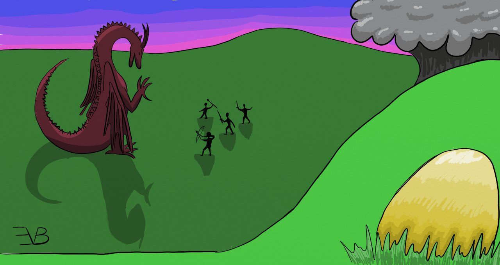

[Back](Auburn.md)

# Auburn Episode 1

## Lost

Pinpricks of liquid chill splashed upon your face rouses you from what was once a peaceful darkness. The sound of millions of pounding spheres of water is now 
impossible to ignore. You cover your face with your arms and roll over, but find freshly turned earth now slick with rain to be what was once your warm bed. 
Finally, you know there is no going back to that peaceful dark place, so you open your eyes. Your vision swirls to the point of nausea and you close your eyes 
once more, but the nausea doesn’t fade.

You listen to the patter of the rain, feeling its icy fingertips grasping at your body, feeling almost peaceful for a moment. The ground rumbles deeply followed by a roar as loud as thunder and cries. Shaken and startled, you now sit bolt upright, your vision clearing enough for the nausea to fade. In the distance, through the rain, you can make out four small figures surrounding and attacking one very large figure very near to the edge of a cliff. 

In fear and confusion at your situation, you decide to run in the opposite direction of the battle towards the safety of the mountain caves behind you. As you stumble off on unsteady legs, the hair on the back of your neck stands up and bumps cover your whole body. Pausing in your fleighing, you look up and hovering not far above you is a horrible winged creature alight with jagged glowing strands. “I thought I had killed you, coward.” It rumbles in a low voice. “But you merely play dead so you can flee and abandon your compatriots. Even us which you hunt have more scruples.” The beast opens its beak and a ball of light begins to form. Your heart pounds in your chest as fear overcomes and freezes you still. 

“Duck!” Behind you, one of the figures that had been fighting the other large beast is now racing to your aide, swinging a large metal chain above their head. You hit the ground just as they let loose the chain and it just barely misses your head. The chain whips through the air and wraps itself around the torso of the lightning bird floating above you. What sounds like a roar emanates from its beak as the ball of light fades and the strands of lightning surrounding it now are sparking against the metal chain.

Scrambling to your feet, you continue to race towards the mountain with the bird distracted. “Where are you going?” you hear from behind you, but you just keep running until you reach the mountain and find a cave to hide in. Finding safety in the shadows, you huddle down and rock on your heels with your arms around your legs. You contemplate the situation, but you have no memory of how you got there or why you were there in the first place. 

You hear squishy footsteps quickly approaching you and your instinct is to continue to flee deeper into the cave. “Rowen?” you hear a call echo around the walls. Finding a large rock on the floor of the cave, you dive behind it to hide from your pursuers. “Rowen? Rowen? I thought I saw . . . Rowen?” The footsteps speed up, coming nearer until a figure appears above you. “Rowen! I’m so glad you are okay.” The figure drops to their knees and wraps their arms around you. You don’t know how to react, so you just sit there, rigid with fear. “Rowen? What’s wrong?” They lean back and you can see their face. Their eyes are filled with familiarity and worry. They seem to know you, but you don’t recognize them. “You don’t recognize me, do you?” You shake your head. Their eyes seem to darken with pain and confusion. 

More footsteps enter the cave. “Carden, did you find Rowen?” Three more figures fill the cave. 

Carden looks up at the other three. “Rowen’s memory is gone. That blast from the Thunderbird must have done something.” Carden looks back to you. “Well, I guess we have some catching up to do. My name is Carden. You and I were . . . close before you lost your memory. Your name is Rowen. You are the leader of our group.” Carden stands up. “This is Fable and Sacha. They are married. And this is Onyx. Do you remember any of that?” 

You shake your head. 

“Perhaps we should collect our quarry and return to camp. We could all use some rest.” the figure called Fable breaks the silence and grabs Sacha and Onyx’s hands, starting to pull them both out of the cave and back into the rain that has now reduced to a light sprinkle, leaving Carden and you alone. 

You open your mouth and are able to let out a couple words. “I-I’m s-sorry.” The words feel foreign in your mouth, the forms feeling unnatural. 

“It isn’t your fault. That Thunderbird hit you pretty bad. We all thought it had killed you. You didn’t move for a long time.” You hear some sobbing from where Carden had leaned back against the far wall. “We thought you were dead . . . I thought you were dead.” 

You sit there for quite a while, listening to their sobs. “T-tell m-me . . .”

Their sobs quiet for a moment. “Tell you about what?”

“U-uss.”

Carden sniffs and draws closer to you, grabbing your hand. They can’t meet your eyes, but just looks at your hand as they grasp it lightly. “I will, but not right now.” Snif. “We should go, um, go help with the Thunderbird.” Carden lets go of your hand and walks out of the cave. You stand to follow her, but everything swirls around you and your side feels as if it has been split open and you collapse to the cold cave floor. Your breathing becomes labored and difficult, so you can’t call out, but luckily Carden hears you and comes back to your side. They are speaking to you, but you can’t make out their words. Slowly, darkness begins to come in again and you can’t help but return to it.

. . .

Creaks emanate from below you and your whole body jostles in its prostrate position. You try to open your eyes, but you are far too weak to move. Slowly, you pick up the voices of your group mid conversation. 

“There is a good healer in Amrora.”

“Too far away and I believe they specialize in bone breaks.” 

“What about Oakley in Paco?”

“Didn’t they retire?”

“Well, we have to find someone who can help Rowen. I was able to stop the bleeding, but the memory loss is far beyond my ability.” 

“There is always the Wish Madge.” 

“That seems rather drastic. That journey is dangerous and Rowen would have to be deemed worthy first anyway.”

“Rowen is worthy. Anyone who says otherwise is wrong.”

There is silence for quite some time. 

“Let’s just get back to Vaso and go from there. We could all use a good rest.”

In the silence and with the gentle rocking, you are able to fall back to sleep and when you wake, you find you have far more energy. Sitting up, you can stretch out your sore muscles. Instead of being on hard wood, you are now on a bed of hay with a blanket on top of you. Looking to your right, you find that the group who has claimed you as their own are laying on similar piles of hay surrounding a fading fire. Deciding you need some time to yourself, you rise from your hay bed and walk a little ways from the dying fire. 

Your group has come to rest in a small vacant barn, leaving their horses outside to graze on the little wild grasses growing in the rocks and parking their wagon just by the door. Looking inside the wooden frame with canvas overtop, you find that they have a good amount of traveling supplies in there from food to tools, comprising most of what the wagon is filled with. To the side is a set of built in drawers and shelves filled with jars of indeterminate contents. The canvas roof is tall enough for you to stand up straight inside and appears rather boxish in shape. Flaps meant to cover both ends are tied back to reveal what is inside. In the front is a bench where the driver would sit, controlling the horse that pulls it.

In your search of the wagon, your eyes fall to a large bag in the middle of the wagon floor. Something about its shape makes you on edge and skittish. Reaching out, the weight shifts and the bag rolls to the side a little, revealing a dark stain in the fabric. “It’s always difficult taking a life.” Startled, you whip around to find Carden standing a little ways off, looking at you, silhouetted by the light of the dying fire and given a ghostly form by the slight light of the half moon. 

“W-what is it?”

“It’s the head of the Thunderbird we killed, the one that almost killed you. We are taking it to the village that hired us. We harvest the rarer or useful pieces of the monster and preserve them too.” Carden is silent for a moment. “Sometimes it gets to me that we have to do so much killing, but what is there to do? There’s no speaking with monsters like that.” 

“Th-the bird s-spoke t-to me.”

Carden approaches you slightly and in the pale light you can see confusion on their face. “No, Rowen, monsters can’t speak. You must have been confused after your accident.” Despite what Carden is saying, you know what you remember, but set it aside for now. “Let’s get you some food. You haven’t eaten for well over a day at this point.” Carden gets up into the wagon and selects some bread, and dried meat for you as well as grabbing a skin filled with some drink. “Come, let’s go by the fire and eat and drink.”

Returning to the fire, you sit next to Carden and nibble on the food and find a tangy drink filling the skin. “T-tell me about th-them.” you ask Carden, but looking over, you find they are curled up and back asleep on the hay, so you return to your meal. 

. . .

Once everyone is awake in the morning, you all continue on the road back down the mountain. Each member has their own horse, including you. This horse, similar to the rest of your group, appears to know you, but you have no memory of this beast. “This is Aspen, your horse of many years. You two have been together since you were both young.” Onyx says, handing you the reins. “You may not remember, but you two are inseparable.” 

“A-aspen.” you repeat. 

“You want to try a ride?”

You nod. Gently, Onyx holds the horse while you attempt to get on, but as you try to swing on, you go over the other side, causing a giggle to ripple through the group. 

“That’s okay. Try again.” Onyx smiles at you and helps you up. You try once more, but have a similar result, except this time, you don’t even get over the saddle. 

“Come ride with me, Rowen.” Fable says from the drivers bench of the wagon. You nod and turn to go sit with them while Onyx ties off Aspen behind the cart. As you settle in, the group sets off on the path leading down the mountain. 

“T-tell me about y-you.” you question Fable. 

“Me? Well, you and I have been friends forever. We grew up together in the little town of Sosa a long ways from here. You and I always wanted to be monster hunters since we were little. We used to play at it on your family’s farm. When we were old enough, we snuck you away since your father wanted you to stay and work at the farm and we set off to be monster hunters.” Fable smiles brightly at the happy memories of you two in your youth. You aren’t able to contain your smile either as contagious as that smile was. 

“D-did we fight m-monsters?”

“Well, we are here now, aren’t we?” 

“I g-guess so.” You two share another laugh. “A-and now y-you are m-married.” 

“That I am. You were instrumental in that. I would never have met Sacha if you hadn’t given me the courage to go have a conversation. That was five years ago now. We have been married for three. And now you are with Carden . You two met a good three years ago when we invited Carden  to be on our team. No good monster hunter ever works on their own, so we got them to join. You guys started going together about a year ago.” You nod your understanding as you process all this. So many important relationships and memories you have just forgotten and now dropped back in the middle of. 

The ride is slow, but is filled with happy banter between your group mates. You happily listen to funny jokes at other’s expense and retelling of past battles against monsters from previous journeys together. While you don’t remember this group or the life you have had with them, you find yourself truly enjoying the companionship that so obviously dwells between each member of the group. The only one not really contributing or speaking is Onyx who rides alongside, listening and chuckling every once in a while. 

Your group arrives in a small village at the base of the mountain near sunset and are met with cheers and praise. An old man waddles towards your group leaning heavily on a twisted staff with happiness in his tired old eyes. Carden dismounts and fetches the head of the Thunderbird from the bed of the wagon and presents it to the old man. “Well done, heroes.” he cries. “You have saved our village from starvation. We will feast in your honor.” 

“We are honored.” Carden hands off the head to one of the officials standing nearby and follows the old man as the rest of us dismount and follow behind. The feast is filled with modest but plentiful food and the mood is light and fun. The villagers play music for you and you dance well into the night. Nearing the end, Carden pulls you aside where you two could speak in private. 

“I know we have both been through a lot on this last trip, and I know you may not understand right now, but I think I will need to take a break from us for a little while. Even before your memory loss, we were having some problems, and I’m not sure I can handle setting up this whole relationship again. I will stay in the group for now, but I don’t want to date you, at least for a while.”

Before you can respond, Carden walks away and returns to the dying festivities. Needing some time alone to think, you decide not to return to the music and dwindling number of dancers and take a walk around the village. You spend the time letting your mind work over the things you have been told about yourself, trying to let the reality sink in to what feels like such a surreal situation. There appears to be such a large disconnect between who you are now and who you used to be.

Not far from the village you find a small lake surrounded by some large and ancient trees and take a seat on a large stone a little ways from the lake’s edge. So deep in thought are you that you don’t even hear Fable walk up. “Hey.” You swivel your head quickly, but relax when you see who it is. “Sorry, I didn’t mean to startle you.” Fable takes a seat on the ground next to your rock. “Carden told me what you two talked about.” 

“I d-didn’t do much t-talking.” you say, more matter of factly than with spite. 

“Are you okay?” You let the question hang in the air for quite a while, unsure of how to answer it. “I guess that is a hard question to answer right now, isn’t it?” Fable leans back with hands in the dirt and begins humming one of the most recent tunes the villagers had played for us. 

“W-what do we do n-next?” 

“You mean you and Carden?”

“No. Th-the group.” 

“Oh, well. Next we will probably head to Clolis and sell the monster parts we have collected. It has been quite a few monsters since we have sold anything and that is where most of our income comes from since villagers usually can’t pay us for our work beyond a meal and some good times. After that, I guess on to our next quest. We have one in Nasall, which isn’t far from Clolis that we will probably go do.”

“So, th-that’s all we d-do? Hunt m-monsters?”

“That’s what puts the food on the table. Why?”

You just shrug. 

“Well, it’s getting late and we will need to leave early tomorrow morning if we want to make it to Clolis the next day. You ready to head back and get some sleep?”

You let your eyes sweep over the still water of the lake once more then turn back to Fable to respond, but the ground is empty and Fable is nowhere to be found. A little surprised they didn’t wait for you, you hurry off after them. By the time you return to the village, all of the music and dancing has gone and the torches that had once filled the area with light are doused leaving you alone in the dark. 

Stumbling your way back to the wagon, you decide to sleep on the floor tonight. You almost drop the sleeping roll trying to find it, but once you have it rolled out on the hard wood, you are able to get comfortable and fall into an uneasy sleep. 

Instead of the darkness your sleep has faded into previously, you are plagued with half-remembered dreams. As soon as you experience them, you seem to forget about them almost immediately. You wake up several times during the night, heart pounding and in a cold sweat but without real reason or understanding of why. The third time you woke up this way, you decide sleep isn’t worth it and to grab some food and take an early morning walk. 

The sky is still dark, but with the gentle tinges of dawn staining one direction. Taking a bite of dried meat, you start off walking towards the sunrise to see how far you can get before true morning comes. Just as you reach the edge of the village, Onyx appears next to you and walks with you in silence. The presence of someone beside you is comforting despite not having any conversation. Just as the sun peeks over the horizon, you stop and take in a deep breath, the cool air rushing into your lungs and filling you with a refreshing chill. 

You look over to ask Onyx if they should head back, but once again you are met with an empty space where you thought a person should have been. With another shrug, you start to return to the village to meet your group and start off on another adventure. Upon your arrival, you find there is a little scurrying amongst your group as they attempt to fill their wagon with the gifts the villagers have given to them. You see everything from baskets of fruit and cured meat to the few coins the villagers could spare, though the coins were returned as it would do little for us and far more for them. 

With our wagon full of fresh provisions for our journey, we set off once again, though with less myrth than the previous day. You feel the word of your break up with Carden has dampened the mood of the whole group, but find there is little you can do about it. Instead of listening to conversation, you watch the world pass you by, seeing the vast lands stretch out before you and the broad range of creatures living in them. 

“Okay, I’m tired of this weird silence thing.” Sacha finally breaks the silence. “We need a topic of conversation to get moving again. Any ideas?” 

“What are we going to do with our money once we sell our monster parts?” Onyx asks. 

“I could use a new string for my bow.” Fable chimes in. 

Looking around you, you notice for the first time that you have no weapon on your person, which seems pretty strange for a monster hunter. “D-do I have a w-weapon?” 

Everyone except Carden looks at you and similarly notice the absence of a weapon. “Yeah, you had a sword which you had won from defeating a griffin on our first mission.” Fable notes. 

“It shattered and went over the cliff when you got hit.” Carden says with a monotone voice. “Sorry.” You get a slight glance back, but nothing more. 
“Well then, I guess we need to get you a new weapon then.” Fable huffs. “That was a beautiful sword. Too bad. For now there is your old one in the wagon. No saying how sharp it is though.” Carefully, you turn around in the seat and begin looking through the wagon until you find a simple, dull, broadsword. 

“This one?” 

“Yeah, that’s it. There should be a scabbard in there too.” 

With weapon in hand, you return to your seat and look over the sword in the better lighting of the sun. There are some deep knicks in the edges and a long scratch going from tip to hilt. “I remember when that happened.” Fable says in reference to the long scar in the blade. “We were playing with it when we shouldn’t have been. That was your grandfather’s blade that your parents kept up on the mantle. You got it down to play with and we got to riding our horses with it when you dropped it and it scratched like it is now.”

“W-we were r-rebellious kids.”

“No kidding.” Both Fable and Sacha chuckle. 

“I want to get an instrument I can learn to play with my portion of the money.” Onyx chimes in randomly. “I want to learn some of those songs we heard last night.” 

“I’m not sure where we will find instruments in Clolis, but we can certainly look.” Sacha says happily. “My axe could use a sharpening too.”

“I need to fill up on some medical herbs too.” Carden mumbles quietly. 

Then your group passes into uncomfortable silence once more. The day passes a lot more slowly than the day before. Without the conversations, there is little to distract yourself with. The scenery which was once interesting now appears the same mile after mile. Nearing nightfall, Onyx notices something on the horizon. “What’s that?” 

A pillar of smoke rises high into the darkening sky with a shadow passing overhead. 

“Looks like another dragon attack.” Sacha says. “Are we up to helping?” 

“Do we have a choice?” Carden asks. “Let’s go.” Your speed quickens dramatically as you race towards the city on fire. 

. . . 

The sword feels awkward in your hand as you help the people of the city out of their homes and away into safety. Having no memory of how to actually use a sword, you feel far less helpful than you were hoping to be. While your group is off battling the dragon, you are running around the city making sure the whole city is evacuated.

“My child! My baby is still in there!” yells a terrified parent pointing into the smouldering wreckage of their home. 

“I will look for them.” you reassure her as you approach the remains. The house is small, making it easy to explore the contents by carefully shifting the hot coals. You briefly notice your hands have blistered from the heat but the pain has gone unnoticed. Finally, you reach the floor of the house and find a little girl lying face down, unconscious or dead, you don’t know. You grab her quickly and put her over your shoulder as you continue helping the stream of fleeing people. Finding her parent, you gently hand her over and they flee out of the city.

By the time the last of the people are out, you have helped at least three people in similar situations, mostly old and young, and many wounded. Tired, beginning to feel the pain all over your body from burns you hadn’t noticed, you turn your attention back towards your group who have now grounded the dragon and are continuing to battle. Watching, you can see how well they work as a team against such a large foe. However something appears to be missing as well, a leader calling out a plan of attack. That’s when you realize that used to be you, and your group is suffering now because you are no longer filling that role. How can you be a monster hunter if you can’t fight?

As you are steeling your courage to join the battle, something catches your eye amongst the rubble. Digging through some more hot embers, you find what appears to be an egg encrusted with gold and jewels. This is why the dragon is attacking the city. Someone took its egg. You heft up the heavy weight of the egg and begin towards the battle as fast as you can. As the dragon notices you and sees the egg, it leaves the battle and starts towards you. You set down the egg and begin running the opposite direction, unsure of how the dragon will react. 

The dragon reaches the egg and gently nudges it with its muzzle. Seemingly satisfied that it is okay, it looks up at you and nods its head. “Thank you, friend.” It then picks up the egg in its mouth and laboriously takes to the air and disappears into the distance. 

“What did you do that for? We almost had it! Do you know how many rare parts are in a dragon?” Fable yells at you. 

“I . . . I thought . . .”

“Fable!” Sacha rebukes as the group approaches. “Rowen just saved us.”

“And we didn’t have to kill it.” Carden  includes. 

“We came here to protect this city, not get a bigger payday.” Onyx includes. 

Fable, still in a radge with no validation, huffs off and begins pacing a ways away from us. “Give Fable some time to cool off. Fable didn’t mean it.” Sacha apologies before following Fable. 

“Good job finding that egg.” Onyx pats you on the shoulder before heading back towards the city. Carden looks at you, but says nothing and follows Onyx, leaving you alone. Watching your group walk away, a group of citizens approach them and start having what looks like an intense conversation. The citizens are obviously upset. 

You look down at your hands and the thought of cool water feels overwhelmingly refreshing. You decide to take a walk in search of a body of water and let the situations defuse a little bit. You walk slightly near to the upset group of citizens and hear Onyx exclaime, “You are the ones who decided it was a good idea to steal a dragon egg!”

Your burns begin to feel scalding hot and finding something cool and refreshing is now irresistible. Walking around the remains of the city with smoke pouring into the sky like a reversed waterfall, you see just how much ruin came from this dragon’s stolen egg. On the far side of the city near to where you and your group left your wagon and horses is a small stream, probably where the city gets most of its water. Leaving your shoes and sword on the bank, you ease yourself into the cool water and let the chill seep into your searing soars until your whole body becomes numb. 

Laying back, you let your ears submerge into the water, muffling your hearing, and let your eyes slip shut. As you float on your back, you let your mind wander and become entangled in the way cooling water can sooth the pain of deep burns, the way the sun heats and the water refreshes and how both are necessary, despite being so opposite. 

When your fingers begin to prune, and the rumble in your stomach becomes unbearable, you rise from your rest and return to your wagon with shoes and sword in hand. “Where have you been?” Carden yells at you. “We have been waiting for over an hour and you have been off swimming?” Getting up in your face, you can tell just how upset Carden is. 

“Hey, relax, Carden .” Sacha gets between the two of you. “Look.” Sacha points to your hands and legs and all notice the severe burns which plague your skin. 

“I-I’m sorry. L-let's get going.” You push past Carden and gently climb up to onto the cart, ready to go.

“Carden, a word.” Sacha growls and grabs Carden’s arm to walk a little ways away. The two of them have a heated conversation out of hearing range while the three of you prepare to leave. You decide to grab a small meal while you wait

“I hope you get your memory back soon, Rowen, or I think Carden  is going to leave.” Fable mumbles to you. 

“Carden has been unstable for a while now and needs to do a little clean up. Maybe taking a break for a little while would be good.” Onyx offers. “We have enough money to hold over for a good few months.”

“That’s going to be a last resort, Onyx.” Fable responds. “We just now have gotten our name to a well known level. If we stop now, the other groups will pass us by.” 

“O-other groups?” you ask

“Yeah. You didn’t think we were the only one doing this, did you? Of course, we are the only ones that don’t charge a crazy fee. That also means we are working more for small villages and cities than for Kings who offer large rewards.” Onyx explains. “We don’t have the credibility yet to be well known amongst many upper tier individuals, but we are well known by cities and villages.”

Sacha and Carden  return, Carden obviously brought down a few pegs. All is silent for an awkward moment before Sacha nudges Carden forward. “Rowen, can I talk with you?” 

“S-sure.” you respond, but you stay sitting up on the bench of the wagon. 

“Just the two of us.” Carden adds. 

You look to Sacha standing behind Carden and they nod in encouragement. Slipping down from the bench you walk a little ways off, Carden  following along behind you. “Look, I’m sorry.” Carden starts once we are a suitable distance away without looking into your eyes. “I’m confused and angry and I’m taking it out on you. You don’t even remember what happened and that isn’t fair to you.”

“I-I don’t know w-what I did t-to upset you, b-but I don’t want you t-to be m-mad at me. W-what did I do t-to hurt you?”

Carden looks up at you for the first time with a little confusion in their eyes. “You really want to listen to me talk about all of this?” You nod slightly. Carden  takes a moment to collect the thoughts they mean to express, eyes down at the ground once more. “We loved each other, but we had our problems. You were always so focused on becoming a monster hunter of great renown. You were so focused on your goal that sometimes I would get forgotten and tossed to the side. I would become just another member of the group instead of someone you loved. I had my own problems too. I’ve always had questions about becoming a monster hunter. I always felt there had to be another way besides just killing. With it never coming into question in your mind and always being questioned by mine, we often fought about all of this. It was rather refreshing to see you solve a problem other than with killing. Maybe we can start over and if you can be different, so can I.” Carden looks back up to you. “Part of why I have been angry has also been that I really do still love you, even if you don’t love me.”

You let this little speech pour over you and sink in. “I-I want to t-try again.” Carden smiles at you and grabs your hand. 

“Me too.” 

Hand in hand the two of you return to the wagon and group who are happily chatting, waiting for you to return. “Hey, there are two happy faces!” Fable cheers. 

“I’m glad you two worked it out.” Sacha smiles to Carden. 

Onyx remains silent, not looking at you at all. 

“Well, now that that is taken care of, we should probably decide what to do next.” Fable continues. “If we try to keep going today, it will be late into the night by the time we reach Clolis and we may run into something on the way. The other option is to camp here and wait until morning.” 

“Are the citizens still upset with us?” Carden asks.

“Probably. They were pretty resentful for us returning the egg they stole.” Sacha notes. 

“Is it smart to camp so close to them then?” Carden asks again. 

“Fair point.” Fable looks to the sky. We have a good couple hours of good travel light left. Why don’t we travel ‘till then and then stop for the night?” 

“S-sounds good to m-me.” you pipe up, hopping back up into the wagon. 

“Hey, Rowen.” Carden looks up at you. “Put this on your burns. It should keep them from getting infected.” Carden hands you a jar of some foul smelling concoction, but you take it with a smile. Fable hops up next to you and everyone else takes to their horses as once more you set out towards your next destination. 

As you sit and apply the balm to your burns, Fable begins to speak. “I’m sorry I snapped at you. I shouldn’t have done that. I know you don’t remember, but I have a problem with my anger sometimes. Most of the time I’m fine, but when I do get angry it can happen fast and it is very strong. You always knew how to deal with me when I was like that. No one could calm me down as quickly as you could. Not even Sacha.”

“D-don’t worry about it.” You smile at Fable and reassure that you have taken none of it personally. 

By the time you decide to stop for the day, you all are exhausted from the day’s events, but happy with the outcome. A quick meal by a warm fire is all you need before a nice long sleep to rest your aching body. 

. . .

Clolis is not much farther away and your group arrives not long after midday. People dressed for adventure litter the streets, shopping amongst the portable stalls of the venders buying, selling, and trading their wares of all sorts. You see scatterings of many different types of things from weapons to adventuring equipment to precious gems and trinkets. 

Your group navigates the stalls with ease, obviously knowing where they are going having been there many times. Just beyond the market place amongst the built structures of homes and city buildings is a small business with a worn door and cracked brick. “Th-this is the m-monster part buyer?” 

“Yup. Been here for longer than Clolis.” Fable says. “It’s thought that this city wouldn’t be here if not for this business.” 

Your party dismounts and approaches the worn door and Carden gently knocks on the splintering wood. “Amari?” Carden calls. “Amari?” Knocking again, the door creaks open ever so slightly, revealing a dark interior. 

“Something’s up.” Sacha’s eyes narrow. Your group ready their weapons as Carden pushes open the door fully. The only light in the room is that streaming in from the open door and your eyes are slow to adjust to the drastic change of light. 

“There’s no one here.” Onyx mumbles as the full interior of the room begins to become visible. Tall shelves reach to the ceiling filled with jars and various monster parts. The silence weighs down with a heft like a blanket in the air. Looking down at your feet, you notice a thick layer of dust revealing your footprints like snow. Nudging Carden, you point it out and the whole group becomes even more on edge. 

“Stay with me.” Carden whispers and grabs your hand tightly to keep you close. As the group navigates the maze of shelves, exploring each one slowly and thoroughly, the only sound that can be heard is the creaking of the ancient wooden floor beneath each foot despite the bustling market just outside. “Wait, everyone stop moving.” Carden whispers. 

Everyone stops and for just a moment, the creaking continues before also pausing. “Something else is in here.” Fable grabs Sacha’s hand for comfort. Out of the corner of your eye, you see a shadow pass over Onyx’s face before they look away. 

“Follow me.” Carden whispers and begins leading the way towards the back of the shop where the buyer’s desk would be. As your group approaches, you feel as if something is playing tricks with your vision, like the wall around the desk has shattered in the darkness of the shop. It isn’t until you are very close to the desk that you realize what your vision couldn’t make sense of: a giant black web.

“Djieien!” Sacha whispers in panic. “We have to get out of here.” 

As the group turns to leave, the door slams shut, sending all of you into darkness. Despite the stillness of your group in their fear, the creaking of wood continues, and approaches. Hissing and clicking begin as you feel the presence of Djieien come near, anger and pain radiating over you. 

“What do we do?” Fable whispers. 

“I don’t know.” 

“Hhhhhhhheaaaaart.” a new voice whispers in the dark. “Hhhhhhheaaaaaart.” 

“D-do you hear that v-voice?” you ask Carden. 

“What voice?” 

“S-saying ‘heart’.” 

“It’s heart!” Onyx whispers excitedly. “The Djieien hides its heart. Someone must have found it and sold it to Amari.”

“So we need to find its heart?” Sacha asks. “If it’s here, Amari would have kept it somewhere safe with how valuable that is.” 

The creaking stops as does the chanting of “Hhhhhhhhhheaaaaaaart.” 

“I-I think it w-wants help.” 

“It’s a monster. All it cares about is surviving. It won’t hesitate to kill us.” Fable hisses. “Don’t forget that.” 

The creaking starts again with an increased pace, the pattering of many feet now audible over the creaking. “Duck!” Everyone drops to the floor with a thud and a large crash emanates behind you where the desk had been. You can’t even see your hand in the pitch blackness. The Djieien squeals in anger and pain and charges again. The group separates and you dodge alone into one of the aisles of shelving. You can hear thudding and stumbling as well as cries and more squeals behind you as your group begins battling the monster in the thick darkness. 

Amari would have kept it somewhere safe . . . Using your hands, you find the edge of the shelf and stumble your way back to the desk. The remains are now large splinters of wood, sharp and heavy. You take another step forward and notice that there is no creak here, despite the heavy load atop of it. Letting your hands come to rest on the weathered floor, and find a small gap between the wood panels that create a square in the floor. Letting your fingers wander in, the whole panel gives way, opening to more dark space beneath. 

A large crash pauses the scuffling and a large section of the wall is collapsed as the monster is thrown into it. Bright light streams into the dark interior. As the monster stands, you get a good look at what your group has been battling: a spider as tall as any man with pinchers like spears protruding from its eye-covered face. The monster hisses and rushes back into the safety of the darkness. With a little light reaching your new discovery, you find that before you is a small cache filled with odds and ends, mainly more jars, dried monster parts, and some money. 

Carden is hit by a hairy leg and hits the wall before crumpling to the ground and not moving. You frantically start searching the cache for the heart, looking through each of the jars to try and determine what it is you are looking at. Fable is similarly hit and a loud snap of a bone echoes through the air. Your hands shake violently and you almost drop the final jar you pull from the cache. 

The cold glass chills your hands pleasantly, but ever so subtly you can feel continuous twitches one after another. Twitch, twitch. Twitch, twitch. Looking up, you see both Onyx and Sacha being entombed under a cascade of wooden shelves and monster parts, neither of them moving. Taking a deep breath, you push yourself up, jar in hand and stand between your fallen friends and the darkness beyond where the Djieien lurks. 

Your heart pounds quickly in your chest, making it hard to breath and think. “D-Djieien.” You stutter uncertainly. The reflection of each of its many eyes appear just within the darkness. “I-I have found your heart. I-It was t-taken from you and s-sold. I-I wish to return it, b-but you m-must let me and m-my friends go. W-we don’t w-wish to hurt you.”

There is nothing but silence for a moment as if it is considering your sincerity. “Deeeeeaaaaaal.” A single leg reaches out of the darkness and you gently place the jar onto it. It grasps the jar tightly and retreats into the darkness and you hear a hum of pleasure. “Thhhhankkkk youuu.” The floor cracks loudly before the beginning of the sound of soil churning and the heavy presence of the Djieien fades. 

A lighter silence fills the air once more and you look to your friends. All of them are wounded and none have been privy to the scene between you and the Djieien. With all of your strength, you try to shift the heavy shelves crushing Sacha and Onyx. Little by little, you are able to shift it off of them, allowing you to pull them free and out of the gaping hole in the wall. After everyone is out, you take stalk of injuries. Carden appears fine beyond a bump to the head. Fable’s arm hangs oddly and is obviously broken. Both Sacha and Onyx will be bruised, but also seem fine. 

Sacha and Onyx are the first to rouse. Still in the mind of the battle, both spring up quickly, taking in their surroundings. “What happened?” Sacha asks. You hand them both some water, but feel uncertain of what to say. No one else was able to hear the Djieien speak. 

“I’m not sure.” Onyx moans. “I don’t remember much beyond the Djieien knocking the shelves onto us. 

“Do you remember anything?” Sacha asks you directly. With a moment of hesitation, you shake your head. “Weird. The Djieien must have found its heart and left.” 

“F-fable’s leg is b-broken.” You indicate to Sacha, who immediately goes to take a look at the break. 

“Rowen, get the healing kit!” Sacha yells. As fast as you can, you make it to the horses and retrieve what looks like a bundle of herbs and return. Returning, you find both Sacha and Onyx trying to rouse Carden to no success. “Both seem to be under the effects of the Djieien’s poison.” Sacha despairs. “I don’t know what cures it.” 

“There has to be something in the shop, right?” Onyx stands and runs into the shop to look around. 

“Rowen, what do we do?” Tears roll down Sacha’s face, hands tight around Fable’s. 

“I-I don’t know.” Both Fable and Carden begin to turn pail, their breathing shallow and quick as the poison takes hold of them. 

“Rowen!” Onyx calls from inside. “I found something. Come and help me.” 

Standing quickly, you find Onyx in a dark corner of the shop. “I found Amari.” Onyx says, voice solemn. Held tightly to the wall is a chrysalis of spider web, blackened to the point you can’t tell what is inside beyond tiny glances. “But look.” Onyx points to where Amari’s hand would be. “I think that’s a Holy Peach. If it is, it would heal both of them.

“L-let’s get it…” You reach out your hand, but Onyx stops you. 

“Whatever the web touches, it adheres to forever. Nothing can break it.”

“W-what do we do?” 

Looking around, Onyx finds a small knife amongst the odds and ends and carefully starts cutting through the web around the peach, revealing a shriveled piece of fruit. “Catch it.” Putting out your hands, the fruit remains plop into your hands, the texture dry and wrinkled. 

“W-will it s-still work?” 

“I don’t know, but we have to try.” The two of your return to Sacha weeping over Fable. 

“Neither have heartbeats.” Sacha gets out through sobs. “They’re gone.” Onyx takes the peach and cuts it in half before cramming half into the mouths of both Fable and Carden. You watch both intently for signs of life. Carden is so pale, brow furrowed it discomfort despite being dead. A full, excruciating minute passes where the three of you desperately cling to hope, watching the pale, unmoving faces. 

Nothing happens. 

Neither Carden nor Fable move. Not an inch. 

Sacha’s wailing continues, face buried into Fable’s chest. You and Onyx stand over the scene, stunned and unable to speak as the feeling of great loss wash over you. The only sound in the still air is that of Sacha’s mourning. Even the sun feels colder on your neck. 

Something shuffles inside the shop and you turn to see a jar rolling towards you and the glint of eight eyes disappearing into the darkness. You pick up the jar and read the label on the side. “Breath of Life.” The jar is completely empty. 

“What’s that?” Onyx says solemnly. 

“Breath of Life.” You whisper. 

“What!” Sacha stand quickly and grabs the jar from you. “Where did Amari get this? This is mythically rare.”

“Can it save them?” Onyx asks. Sacha nods. 

“Pull the two of them close. We have one blast, one chance.” You and Onyx prop Carden and Fable up, holding them close together as Sacha holds the jar near to them. “Ready?” You all nod and Sacha removes the lid. Both Carden and Fable jolt and begin breathing, moaning slightly as they begin to shift and move. 

The three of you cheer as they come too, but a sudden shift happens within you, like something coming awake within you and beginning to battle you for control. You stumble back, falling to the ground as your whole body clenches, fighting against this awakening force. No one appears to notice your struggle, focusing instead on Carden and Fable as they recover and sit up. 

_Fraud!_ A whispering voice you don’t recognize rings in your head. _Fraud!_ The sensation slowly fades in intensity, though the presence remains as a whispering voice within you. Shaken, you return your attention to your strengthening friends now smiling and laughing. Sacha has enveloped Fable in a huge hug, sad tears now changed to happy. 

_Fraud!_

Carden looks to you and smiles, grabbing your hand and pulling you into a large hug as well. 

_Fraud!_

“Thank you.” Carden smiles, pulling back a little to give you a kiss on the lips.

_Thief!_

“I’m never letting you go again!” Sacha wheaps into Fable’s shoulder. 

_Liar!_

“All thanks to Rowen.” Onyx smiles at you. “Cheers to having our leader back.” 

“Cheers!” your group cries. 

_Deceiver!_

## **End of Episode 1**

[Back](Auburn.md)
