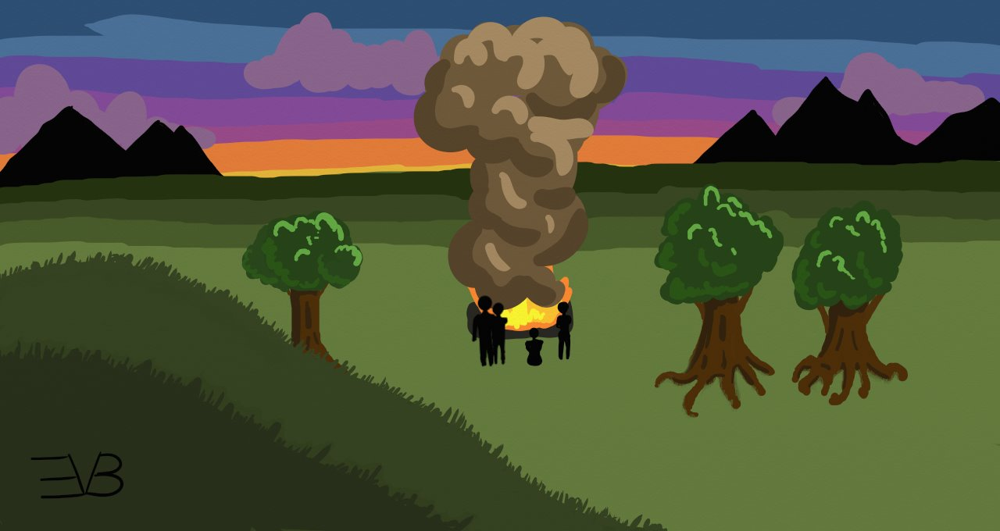
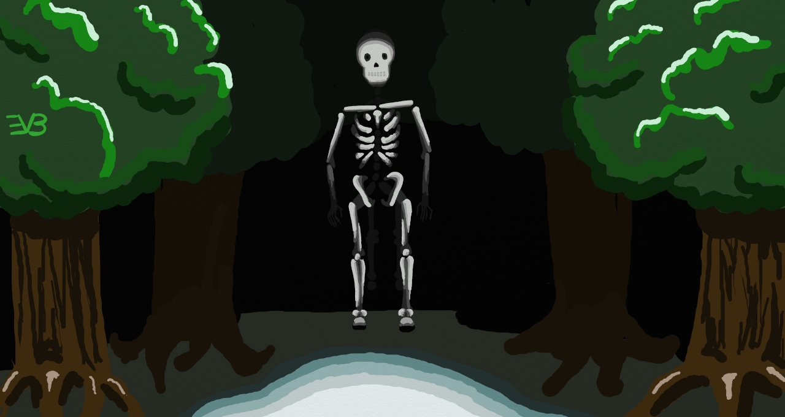
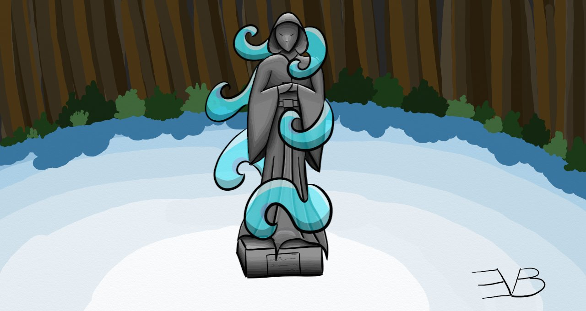
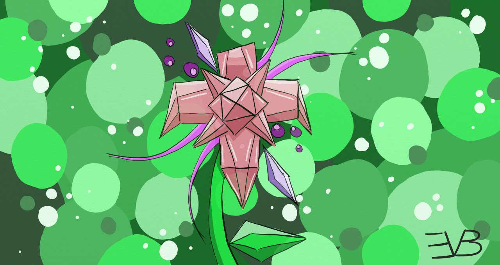

# Auburn Episode 2

## Quest

“So, what are we going to do about this place?” Fable asks as you and your group shift your attention back to the shop. 
	
“With Amari dead, no one is here to run it. Did Amari have family? Children?” Onyx asks.
	
“Not that I knew of.” Sacha replies. “Never married and lived alone I believe.”
	
“We should at least bury him. Maybe let the locals know what happened.” Carden says. “That is the least we can do. As for the store and its goods, should we leave it to the locals? We could take what we want first.”
	
You find yourself only half listening to the discussion, completely shaken by what you had just experienced. Should you tell your team? Are you just going crazy after losing your memory? 
	
“Are you doing okay?” Sacha sits down next to you on the grass overlooking the shops and stalls selling goods. “You seem a little pale.”
	
Before you have time to think about it, you say “I...I’m fine.” 
	
Sacha nods, watching the people go about their business in thought. “Same old Rowen. Well, I’m here if you want to talk. You have been through a lot. It makes sense you are having some problems right now. I know you have no memory of Amari, but we are going to have a burial if you would like to come.”
	
“I...I’d rather s...stay here for the m...moment.” Sacha nods and leaves you alone and joins the rest of your group for the burial. Standing, you decide to walk into the store to have a look around to perhaps find something that might give you some answers. With the windows now open, you can see clearly through the dust-filled air. Many golden particles gleam in their floating paths through the air in the beam of the sun’s reaching light. Tall wooden shelves create a maze through the store except for the carnage of the battle to the right. Each shelf is stocked full of hazy jars filled with numerous and often unrecognizable things. In the back you once again find the web that had entrapped Amari, now absent of the body. 
	
The desk lay smashed not far away, but something catches your eye amongst the carnage, something shiny between the broken boards. With a little digging, you find a very fine sword that looks almost delicate in its craftsmanship. Something draws you to it, something in its make feels familiar, the first thing that has felt familiar in all that you can remember. A wave of relief washes over you as you pick up this sword to the point it brings a tear to your eye and you realise just how tense you have been. You take a seat next to the rubble and let the feeling work its way through, leaving you with a curiosity about the sword and its history. 
	
With the feelings faded, you tuck the sword under your arm and continue looking around to see what else you can find. You find a stash of money that Amari kept amongst the rubble of the desk along with some more valuable items like gems. With quite the collection in your arms, you take your findings outside and make a small pile which now gleam in the fading sunlight. 

Just down the hill, you see your four friends standing around a pyer, the smoke rising into the air with the sun setting in the far off horizon. You bow your head, feeling the sadness radiating off of your friends and find yourself wishing you could remember anything from your life before. Racking your brain, you try as hard as you can to find some answers, but still nothing comes. It isn’t even like you are trying to grasp something just beyond your reach, but as if there isn’t anything there at all. 

Returning to the shop, you enter the back room where you think Amari must have spent a lot of time. Sketches of different monsters line the walls with a small bed in the back corner and some other chests just below the sketches. On the small table next to the bed sits a note, slightly crumpled, but still readable. The letters are foreign to you, but you pick it up to bring to your friends. They might like to see it. 

Going through the chests, you find some of Amari’s most prized possessions. A child’s blanket wrapped around two pewter rings is covered in dust in the very bottom of the smallest chest. Gingerly, you pick up the blanket and rings and bring your findings out and down to your friends. 

“I found these inside.” You whisper to them, handing Sacha the blanket and letter.

“I didn’t know Amari was married. Or had a child.” Onyx says. 

Fable takes the letter from Sacha and reads it. “This note says that Amari did this on purpose.” Sacha’s eyes frantically search the page. “Amari kept the heart on purpose, knowing the Djieien would come for it. It sounds like Amari has been battling some deep emotions since their child died. Apparently after that, Amari’s spouse died of sadness and Amari was left alone to run the store. Amari just wanted to die.”

All eyes turn back to the pyer, watching the lifeless body of a grieved form burn and float up to the sky. Perhaps not remembering your past is a gift. While you can’t remember the people you know, you also can’t remember all of the pain and grief that came with your past. 

After watching the fire a little longer, some small conversation begins between the group. 

“What do we want to do with the shop?”

No one is quick to respond. “Well, we should look to see if there is much of value. There will be no one to take over the store. I doubt anyone from the market will take it over.” Sacha sighs. 

“Is there anyone else who buys monster parts?” You ask. 

“The monks of Nasall will buy some for their potions. I’m sure we could find sellers to buy from us eventually.” Carden mumbles morbidly. 

“Well, we can take what we can carry and do what we can, I guess.” Fable agrees.

With the fading light, you all turn from the still burning pyre and return to the security of the store. Carden notices the small pile you had already pulled from the store. “We should put this in the wagon.” Shifting through the coins and gems, Carden notices the sword. “Did you find this in the store?” You nod. “This is a monster sword. It was probably forged in the monster capital.”

“I wonder how it got here.”

Carden looks at you. “I’m glad to hear your speech is clearing up.” Carden smiles sadly. You smile back as Carden wraps you in a hug. Such and action fills you with warmth and comfort as you have never felt and you can’t help but hug Carden back. 

Finally pulling apart, Carden collects the small pile from the ground and takes it back down to the wagon. You watch Carden go before turning and following the rest of the group into the store. They have already started going through the store and setting a pile on the floor of bits and pieces you don’t recognize, but the thought that these parts were once monsters makes you shiver a little. 

You settle down against the wall, watching your friends thoughtfully choosing what to pull from the shelves. _These aren’t your friends. You don’t even know them._ You shake your head, trying to ignore the voice. 

Carden comes in toting some food to pass around for your evening meal. “We are going to need to get some more provisions soon. We will only have another meal or two before we are out of food. We can use the money we found here.” 

The group comes around and silently eats the food they have. As the night wares on, the pile of parts you will be taking with you continues to increase until a small mountain sits in the center of the room. 

“Where will we go next?” You ask the group as you sit around a small fire Carden had built, waiting for morning. 

“We should go on to our next quest in Nasall. We could probably sell some of our goods there too.” Fable’s eyes never leave the fire. “The monks of Nasall will be expecting us. Too much longer and they will decide to open the quest to other Monster Hunters.”

“As we approach Kadon, the capital city, we will see more of other clans coming to get new quests.” Carden adds, trying to explain things to you as they go. “Even though Stormstand, our clan, is five years old now, we just haven’t gained any notoriety as we have yet to complete any major quest.”

“We aren’t in this for notoriety. We are doing this to help people. When a clan starts getting more attention, the smaller and poorer villages are the ones who pay for it. We are one of the few clans that actually respond to the outer villages.” Fable argues, turning to you. “We started this clan to help people who can’t help themselves. We take the quests others won’t, the quests that have little reward because the people asking for help have little to give. To gain the notoriety that Carden is speaking of, we would have to ignore their pleas for help and go after the quests involving the large powers that be who have dozens of clans to pander to them and squabble for their dangling scraps.” 
The rest of the group grows quiet as the moon casts its pale glow, washing out the land. “We should get some sleep.” Sacha sighs. “We will start out early tomorrow. We should be able to reach Nasall by noon if we leave early enough.” Everyone settles down for the night, but your mind can’t rest. 

_Thief! Monster! Lier! Betrayer!_ Over and over, the voice you heard before chants horrible names, keeping you up, causing your head to pound. You toss on your uncomfortable blanket feeling a chill that sends shivers up and down your arms. 

The hours drag on and sleep still evades you. The fire has died down and the others are snoring lightly in the early morning hours. You sigh and sit up from your blankets, rubbing your face and eyes in a desperate attempt to quiet the consistent voice in your head. 

The sun rises and neither sleep nor an answer to the sudden voice has come to you. Carden wakes and rouses the others as the sun peeks over the horizon. It doesn’t look like anyone else has slept well either as you are all slow moving and quiet in the early morning hours. 

With all of the new inventory crammed into the wagon, you all set off just as the sun fully appears over the horizon. As you go to take your normal seat next to Fable on the wagon, Carden stops you. “Maybe you should try riding Aspen again?” You look to the poor horse tied to the back of the wagon nervously. “Aspen loves you and misses you. I can tell.”

“I don’t want to fall off.” 

“You need to learn.” Carden goes over and unties Aspen from the wagon and returns to you. Holding Aspen’s head, Carden begins instructing you. “I will hold Aspen’s head so you will have a still mount. You grab the reins and some main in your left hand. Face towards Aspen’s head then put your left foot in the sturrup.” Carden waits as you try your best to follow the instructions. “Now grab the back of the saddle with your right hand then use your leg to spring yourself up.” You get yourself to the point where you are kind of laying over Aspen’s back with your legs over one side and your torso over the other. “Now let go with your right hand and slide your right leg over to the other side of the saddle.” Surprisingly you are able to settle into the saddle, this time without falling out. 
You let out a little surprised laugh and smile down at Carden who smiles back up at your, gently stroking Arden’s neck. “And that’s how you mount a horse.”

“You are good at teaching.” 

“You are a lot better at learning than before.” Carden’s eyes drop down to Aspen’s head. “There are a lot of things about you that are different.”

“Hey! Enough goo goo eyes. We need to get going.” Fable yells from the bench of the wagon. 

Carden blushes and lets go of Aspen’s head. “Um . . . to make Aspen go make sure you squeeze with your legs a little, and push forward a little. You can control where Aspen goes by pulling on the reins in the direction you want to go. You shouldn’t need it, but if you should need to make Aspen go faster, give a little tap with your heels.” With that, Carden turns and leaves you to get familiar with Aspen a little before you start off. 

You do as Carden says and Aspen starts walking forward to the other horses. “This seems a bit more normal.” Onyx smiles. Aspen whinnies a little as if excited to be ridden again. 

With that, you leave the shell of Amari’s Monster Part Shop and set off over the rolling hills between you and Nasall somewhere beyond the horizon. 

_Carden is not yours. Carden is mine._ Once again you shake off the voice, but still worry spreads as you still cannot figure out where the voice is coming from. You switch to focusing on not falling off Aspen as you and your clan travel quickly along the road towards Nasall. The day wears on and the sun beats on your back causing sweat to break out across your skin in spite of the brisk wind that catches you ever once in a while. Talk turns from the sadness behind you to the quest ahead. 

“So, the problem in Nasall seems to be that some large group of monsters are trampling and burning down the monks’ fields. It only happens at night and only on nights that the fields aren’t watched, so the monks have no ideas what the monster could be. I guess no tracks were even found.” Fable says, looking at a small card with lots of writing on it. “Looks like someone named Jesse.”

“A hoard of monsters that are never seen. I don’t know if that applies to any known monsters.” Onyx says thoughtfully. 

“What is known about monsters?” You ask. 

“Honestly very little, but what we do know can be found in Fable’s journal.” Carden motions to Fable. 

Fable pulls out a rugged leather bound book with many loose pages sticking out at odd angles. “I’ve put this together from all of the monsters we have fought.” Fable says proudly. “I’m going to be the first person to put together an encyclopedia of monsters. I call it my Big Book of Monsters.”

You take the book and gently flip through the pages, making sure not to lose any of the loose pages. Each page covers a different monster with information that you can’t make out. Most even have a rough sketch of the different monsters. “This is awesome.” You smile, handing the book back to Fable. 

“If you ever want to flip through it, just let me know.” You shift uncomfortably as you remember the note from Amari that seemed so foreign. 

Carden, seeing your face asks, “Do you not remember how to read either?” You shake your head, embarrassed. “I guess we can teach you that again too.” Carden sighs. “Is there anything else you can’t remember?” 

“I’ve basically been learning everything again. I think that was why I was stuttering so much. I was learning the feel of the words in my mouth. I don’t know how to use this either.” You say, patting your sword. “That’s why I didn’t help with the dragon before.” 

The group seems a little distressed by this, feeling frustrated by your lack of skills. “So when you woke up, you knew absolutely nothing?” Sacha asked with fearful eyes. “That must have been so scary.” Your eyes slip down to Aspen’s saddle and you say nothing. It briefly crosses your mind to mention the voice you have been hearing, but decide against it so as not to further upset your team. 

The sun is fully up when you come to a crossroad where another group is breaking their camp. “Uh oh. Here’s trouble.” Fable grunts. 

“What’s trouble?” You ask.

“It’s another clan.” Sacha explains. “And not a friendly one either. They are called Fallendawn. They are one of the most requested clans, and they will be sure you won’t forget it.”

“Hold up a minute.” Carden stops the group before the other clan notices them. “What if they notice the difference in Rowen?” Everyone becomes a little worried. 

“What would happen?” 

“If they find out that something is different in the group, they could report us at the One Stop Shop and we could get our rank lowered, which further reduces what kinds of quests we can take.” Carden explains. 

“They would do that?” 

“I wouldn’t put it past them.” Onyx agrees. “What should we do?” 

“I’m not sure.” Fable grunts. “This is usually Rowen’s expertise.” 

“I guess we will just have to bear whatever happens.” Sacha sighs. “You were just saying how we needed to keep serving the smaller villages anyway.” Fable gives a conceding head bob. “I think we should just walk past and not engage, even if Rowen was fine.” 

Everyone agrees to pretend to ignore them and hope for the best. As your clan approaches the crossroad, Fallendawn takes notice and stands in the middle of the road, blocking your path. “Well well well, if it isn’t Stormflop.” The one who appeared to be the leader laughed, arms crossed. 

“Get out of the way, Kieren.” Carden says in an exasperated tone. “We have no quarrel with you.”

“Now, that isn’t exactly true, now is it, Carden?” Kieren puts a hand up in a thoughtful way and begins pacing. “I seem to remember a previous quest, say about two years ago?”

“Uh, you aren’t still on that, are you?” Fable groaned. “Get over it, Kieren.”

“You owe me honor!” Kieren exploded. “And I will get my honor back.” Kieren looks to you. “You owe me a battle.” 

“I don’t owe you anything.” You respond in your most evenly toned voice as possible, though your voice cracks a little near the end.
Kieren and the whole Fallendawn clan laugh at you. “I challenge you, Rowen Hart, to a Steinar.” Everyone gasps, including the other clan. One of the members of the other clan runs up to Kieren and tries to rescind the challenge. “No, it is the only way and it is going to happen now.” Kieren growls at the clanmate who then retreats back. Kieren turns back to you. “So, Rowen, do you accept my challenge?” 

You glance at your friends, each of them giving a different response. “Fine, if to do nothing more than to teach you a lesson.” You carefully and a little clumsily get off Aspen and walk up to Kieren, a little unsure what will happen next. “You know the rules. First one to kneel is the vanquished.” You nod as if you know what is going to happen next. Kieren turns and walks back to the small camp and prepares for whatever will come next. _You better not get killed for this._ The voice grumbles in your head as you return to your team to try and find out what is going on. 

“What did you do that for?” Carden smacks you on the arm. 

“Well, from what you have told me of who I used to be, I wouldn’t have backed down from a challenge, right, especially where honor is involved?” Everyone is silent, but nods. “Now, what is this Steinar thing?”

They quickly give you an overview of what will happen. It is basically a weight holding competition where rocks are stacked on your back. The same goes for Kieren. Whoever kneels first loses. “Seems simple enough.” You nod. 

“Not quite, see there is a little bit more. The opposite clan can hurl both insults and things at you to try to get you to kneel.” Carden’s brow furrows in worry. “People have gotten really hurt in these challenges.”

“Well, nothing that can be done about that now.” You nod. “Will you guys do that to Kieren?” 

“It is seen as a dishonorable way to win.” Onyx explains. “But that won’t stop Kieren and his clan. I’ve seen them get viscous. The only real rule is that the other clan can’t touch you during this challenge.” You take in a deep breath and let it out to try and keep yourself calm. 

With that, you turn and head back towards the middle of the two clans where the challenge will take place. Fallendawn has taken the time while the two of you were preparing to collect quite a few large stones, each looking very heavy. Kieren gives you a crooked smile as one from each clan begins piling on the stones. For each one you get, Kieren also gets one. 

The first one doesn’t seem so bad. It’s manageable. But there is a long wait between stones. During this time, not only does the stone begin to feel heavier than it once did, but the other clan begins doing just what your friends said they would. They begin with getting in your face and spitting insults at you, not being afraid of getting their saliva on you. Words you don’t even understand are yelled at you, but you can tell they are obviously horrible names and curses. Oddly enough, you notice that the one clan member who tried to stop this from starting is the only one refraining from the belittlement of you.

Finally the second stone is set on your back and you feel like you are going to drop immediately, but you push on. That’s when small rocks begin to fly amongst the yelling and cursing. A sharp rock catches you in the face and slits your cheek open releasing hot blood down your cheek that has already been covered in salty sweat. Over the yelling, you can hear your own clan calling out cheers of encouragement, and that is what you latch onto for strength. Your eyes close in your intense focus and it is a good thing too as you feel that one of the vindictive clan members had tried to throw dirt into your eyes mere seconds after your eyes had slipped closed. You spit out the sand and keep focusing on your friends voices for comfort. 

A third stone is added, but your legs stay firm despite the shaking of your arms and back. More stones hit you, this time in your arms and legs, causing more cuts to bleed all over, but you hold on as best you can to the three stones pressing you to kneel. You are so introspective and so focused on keeping the stones from crushing you, that you don’t even notice that the thrown rocks and insults have stopped. All you can feel is the stones pushing you down. It is only the gentle touch of a hand on your face that makes you open your eyes. Cardon’s wonderful face smiles back at you and you know you have won. 

Your clan helps you unload the stones safely as you survey the results of the challenge. Kieren is lying face down, the three stones laying on top with Fallendawn trying to get the stones off to help their leader. “I can’t believe you won.” Fable says, incredulously. “I haven’t seen many of these challenges, but none of them have gone up to three stones.”

You shrug and gratefully lay flat on the ground, resting your whole body. “Let me get those cleaned up and some bandages on those.” Carden approaches holding some healing herbs and bandaging cloth. You don’t move as Carden tends to your wounds and Onyx brings you some water. “Looks like your other wounds have healed up nicely too. I forgot to check those with all of the events the last few days.”

“Yeah, I’m glad they weren’t hurting me.”

“What were you thinking? You could have been killed.” You look over and see the clan member admonishing Kieren. 

“You are so overprotective.”

“You just broke both your legs, Kieren!”

“Looks like we aren’t the only one who thinks Kieren is stupid.” Fable chuckles. Your team helps you up and you all mount your horses once more. 

“Now.” You say, still a little out of breath. “If you don’t mind, we shall be on our way.” And with that, you set the pace, leading your clan through the camp of your fallen foe and continue on your way towards Nasall. 

It isn’t long before a small village appears on the horizon. “Is there anything about the people here I should know?” You ask.

“I mean, the monks here don’t really talk. Most have taken a vow of silence and have come here to separate themselves from the world. They are a sanctuary to all who come here whether to retreat temporarily from the world or permanently, but they are cautious of outsiders. It is unusual that they should invite anyone here like us, so they must really be in need.” Sacha explains. “Just everyone be polite and I believe we should be okay.” 

As you approach the city, you can begin to see individuals with bright green clothes out working in the field along with bright red clothes working within the village proper. When the first monk sees your group, they drop their farming tool and run into the village, returning quickly with another wearing bright purple clothing and carrying a twisted walking stick. “Travelers. What has brought you here?” The monk wearing purple asks. 

“We have come in response to a quest.” Fable calls from the bench of the wagon. 

“Ah, welcome, Monster Hunters. You have arrived just in time. The last of our crops have just perished in another attack and we run low on food. Come with me and we will talk over these matters. Leave your horses. They will be tended to.” With that, the purple monk turns and starts walking, leaning heavily on the walking stick, expecting you to follow. 

The clan dismounts without a word. As your friends go to follow the monk, you turn back quickly and decide to grab the sword you had found at Amari’s store. Sliding it into your other sword’s sheath, which it doesn’t quite fit into, you run to catch up with your group as some monks approach the horses and wagon to care for it all. 

Jesse leads you into one of the small hovels that compose the village. Entering the hovel, the monk is sitting on the floor, waiting for you to join. As you file in and settle, the monk sighs heavily. “My name is Jesse.” Jesse starts. “I was the one who put in the quest. This problem has been going on in some form or another for many years, but this time, it will be the death of us. While no monster has directly killed any of us, there have been many plights upon our village over the course of the last twenty years. Plights that can only slightly be attributed to monsters, but after this plight, I have no doubt that it truly is monsters behind our poor fortune.” Jesse looks to Fable. “There are times where our river has dried up in the summer when it should be the fullest. There are times where we did not see the sun for months at a time. There are times where no new monks have come for years. There have been sicknesses, unexplainable wounds, voices that were completely lost, and now our crops are failing. Please, you must put an end to this before this village is no more.”

Jesse looks desperate for the monks of this village and you can’t help but feel for them. “Was there anything that happened twenty years ago that could explain where the monsters came from?” You ask. 

“Some centaurs came and stole our children. They are horrible creatures that look like a human from the waist up, but below they bare the body of a horse.” Jesse starts after a moment of thinking. “I believe we put forth a quest for that too, but I’m not sure what came of it. That was before my time as the elder here. All I know is that we never got our children back and the centaurs never came back.”

The group is silent in thought a moment before Fable speaks up again. “Can we see the fields that have been destroyed?” 

“Of course. This way.” With help from the walking stick, Jesse gets up and leads the group out to the fields where some monks are desperately trying to replant to get at least some food before winter. “This field was destroyed last night.”

The group fans out and begins looking over the field to see if whoever had attacked the field had left anything behind as a clue. Some long stocks of grain lay crumpled on the ground as if trampled while others lay short as if cut down. You watch the turned dirt and notice that the hills and valleys seem very regular in their appearance, as if whatever left them ran in rows up and down the field to get everything that it could. It wasn’t random in its attack. You approach the edge of the field and notice there are some very slight indentations in the greenery just beyond the field. Approaching, they look like some kind of tracks. “Hey!” You yell. “I found something!” But none of your friends are close enough to hear you. You sigh and decide to see if the tracks lead anywhere before alerting anyone to them. It might just have been some curious animal. 

Despite your inexperience with a sword, you draw the monster blade and carefully begin to follow the tracks. The tracks start out going as straight as possible towards a small grove of pine trees not far from the farmland around the village. Once the trail finds its way to the treeline, the line begins to meander far more, weaving between trees and not really following any real direction in particular.

Just as you think that you were right in that it was just some random animal tracks, the tracks just disappear in a small clearing amongst the trees. Confused, you search around the clearing, but there are no more tracks, just the ones leading into the clearing. Despite the afternoon sun, you notice that it feels dark and cold in this clearing. Goosebumps run up and down your arms and legs, your knuckles go white with how hard you are clenching the sword. The air is so still and so cold here, it’s as if you can feel that this place is not as it seems. This place feels cursed. 

Silently, tendrils of grasping mist begin billowing into the clearing from amongst the trees. The mist swirls in mini twisters throughout the clearing until the whole forest floor is obscured from your sight. Shaking, you begin to try and back out of the clearing, but your back hits something very solid. You jump around and are met with something otherworldly and beyond your comprehension. A full human skeleton with no other parts stands before you, but something is wrong with its lower half. It bulges in a strange way that your brain can’t understand. The hollow eye sockets stare down at you, the skeleton perfectly still. 

Your heart beat and excited breaths are all you can hear in the cold clearing. You back away from the monstrous form, leaving a trail in the mist heavy on the floor, your hot breath leaving as steam from your mouth. “What do you want?” You ask in a shaky voice, both your hands grasping the sword uncomfortably. The monster just continues to stare at you with its hollow eyes. “Have you been doing all of those things to the village?” With some rough grinding and clicking, the head of the monster nods its bare scull. “Why?” The skeleton does nothing. “Are you going to hurt me too?” Some grinding and clicks and it shakes no. 

You can feel yourself relax a little as you continue to try and make sense of what is standing before you. “What are you?” The skeleton steps towards you and turns to the side so you can see its profile. This is not a human skeleton, but a human torso on the body of a four legged creature. “You are a centaur.” You mumble more to yourself. “Are all centaurs just bones?” The skeleton shakes no. “So something happened to you.” The centaur skeleton lays down in the mist before once again sitting as still as a statue. “Did you steal the children from the village?” Its head drops, but slowly nods. “This is your punishment?” Another nod. “The monks did this to you?” Nod. You slump down beside the centaur skeleton. “If the monks can end this punishment, would you leave them alone?” The centaur’s head perks up and looks to you before nodding almost happily. “Is it just you left?” Nod. 

You sit a moment longer then stand, looking down into the skeleton’s face. “I will go talk to the monks and see what they say. I will try to convince them to release you.” The centaur performs a little bow to you before you set off at a quick pace back towards your friends and the monks. 

---

“So you followed weird tracks into the forest without telling anybody?” Carden asks in almost a yell. “Are you really that stupid?”
	
“Just hear me out.” You plead and Carden backs off a little, but you can still tell that Carden is upset. “While I was out there, I met the monster that has been doing all of this.”

“You defeated the monster already?” Jesse asks, excited and happy. 

“No, I haven’t. But I don’t think it will need defeating.” You respond. “You see, it is one of the centaurs that stole your children twenty years ago.”

“What? Why has it stayed here for so long?” Fable asks, flipping through the Big Book of Monsters to find the page on centaurs. “They are usually nomadic. And you said there was only one? They are by far a herd monster. That’s so strange.” 

“That’s not the half of it.” You go on. “The reason it is still here is because it was cursed by the monks for stealing their children. It is a living skeleton.”

“That can’t be right.” Jesse interrupts. “No monk is allowed to use magic, especially not an elder who would be in charge of a matter like this.” 

“Is the elder still here that was in charge then?” Sacha asks. 

“No, Remington passed on a few years ago. No children.” Jesse sighs. “I didn’t really know Remington. But either way, I wouldn’t know how to release such a curse even if I wanted to.” 

“The centaur has agreed to leave you alone if it is released from the curse. Is the lives of your people not worth letting go of a past injustice?” You ask. Jesse grumbles, but says nothing more. “Is there anything you inherited from Remington?” 

Jesse stands in anger. “I put in a quest for Monster Hunters, not Peacekeepers. Go do your job and hunt down that monster and kill it. Stop pulling at old ties that are long past.” Jesse pounds out of the room in anger. 

The room is silent in astonishment for a moment. “I thought monks were peaceful people. Why are they so focused on killing?” You ask your group. 

“Losing children, even if they aren’t your own, is never easy, much less to a monster. There is no telling what happened to all of those children.” Sacha says, sadly. “Pain like that doesn’t easily heal.” 

“But they are going to lose more of their people if they can’t let go of that anger.” You reply with passion. “And it will only continue the bad blood and the anger that has been going on for the last twenty years.”

“We aren’t going to get anything more from Jesse.” Fable sighs, sidestepping what you said. “We will need to just kill it, though I have to admit, I don’t know how to kill a cursed undead skeleton centaur.” Fable’s head shakes with how crazy a statement that was. 

“Well . . .” Carden says a little nervously. “If there is magic involved here, there must be something directing where the magic is going and something powering the magic. If we can disrupt either of those two things, we should be able to break the curse.” 

“I didn’t know you knew magic.” Onyx says in surprise. 

“You pick up some standard things here and there.” Carden responds nervously.

“So how do we find either of these objects?” You ask. 

“I assume that Jesse probably has the power source, but the pointer will be something else, probably something in the forest close to where the centaur has to stay.” Carden mumbles. 

“And how do we break it?” Fable asks. 

“It is just a normal object. We smash it, the magic will escape.” Carden says. “The problem is, it could be literally anything, from a tree to a small rock. It could even be something that is buried in the ground where no one would accidentally stumble across it.”

“That will make it challenging.” Sacha agrees. “Perhaps we should go check out the forest and see if we can find anything.”

With that, you all stand and move to leave, but Carden catches your arm to keep you in the hovel a moment longer. When you are alone, Carden asks you something. “You said that the centaur agreed to leave the villagers alone.” Carden begins. “Are you able to speak with it?”

You are unsure what to answer as Carden watches you nervously. “Well, the centaur would just nod or shake its head for yes or no.”

“And the other monsters we have come across?” Carden presses. 

“I’ve been able to speak with them all. The Djieien back at the store was asking for its heart when it attacked us, which is how I knew to look for it. And the dragon thanked me for returning the egg. Even the thunderbird spoke to me.” You bow your head. “And after you said monsters couldn’t talk . . .” 

“When did I say monsters couldn’t talk?” Carden’s confusion grows greater. 

“When I woke up after the battle with the thunderbird.” You try to remind Carden. “I got up to look at the wagon when we had taken refuge in the barn on the mountain and you came up and talked with me.”

“Rowen, that didn’t happen. You didn’t wake up until the morning after that night.” Carden looks at you in concern. “Maybe we should take you to a doctor after all you have been through. I’m sure we could find one in Kadon. As far as talking with monsters . . . I have no idea what that could mean. We need to tell the group about this after this quest is over and you need to tell us if a monster is saying something from now on, got it?” You nod. “Now, let’s go deal with this last problem before we cover all of these new ones.” 

You follow the others outside feeling the concern growing within you once more as to your condition. And you hadn’t even mentioned the strange other voice in your head after inhaling the Breath of Life. You try to shake it off as you follow your friends back to the field. “So, Rowen, where were the tracks?” Fable asks. 

You pull yourself from your thoughts and lead the group to where the tracks were, but as you approach where they should have been , there are no signs of them at all. “They were right here.” You say in disbelief. “They started here and led straight into the forest over there.” 

Carden looks at you in concern. You can tell Carden is now doubting everything you are saying about what you saw. Perhaps the skeleton centaur never existed to begin with. “Seriously, they were right here.” 

“Maybe we can find them once we reach the treeline.” Fable says. “Maybe the tracks got swept away with all of the farming that the monks have been doing to get this field replanted.” You all head off towards the forest and even where you remembered going in is now completely free of any tracks. 

Sacha looks towards the sun as everyone is searching for the tracks. “It’s close to sunset now.” Sacha says. “Perhaps we should try to sell some of our monster parts to the monks and then retire and try again in the morning.” 

“I suppose that is the best idea for now. We will be only doing harm out here in the dark. Let’s go find our wagon and get some food. I’m starved.” Fable agrees. Fable takes Sacha’s hand and the whole group starts back off towards the village, Sacha and Fable already debating which monster parts the monks would be interested in. 

“You don’t believe me any more, do you?” You sulkingly ask Carden. 

“I believe you saw what you said, but I’m not sure it was really there.” Carden says sadly. “It wouldn’t be all that surprising that you could be seeing things that aren’t there. Even before your accident, you have seen a lot of things that would have made anyone go crazy. The bump to your head might have been enough to cause you to start seeing things that aren’t really there.”

The two of you say nothing more as you return to the village and settle in for supper and some sleep while Sacha and Fable handle some trades with the monks. When the others finally lay down to sleep, you find yourself unable to rest. Your head aches with how many different thoughts are passing through it. Worries of what things you are seeing are real and what things are just in your head? Are monsters really talking to you or is that just your brain just being broken from your injury? Did you really see the skeleton centaur? Were the tracks really there before?

With your thoughts abuz, you grab a piece of wood from the fire by the unburnt end and begin walking back out towards the forest. You needed to see for yourself if the centaur was really there or not. You pause at the edge of the pitch dark forest, looking for any signs of the tracks, but still there are none. With a fortifying exhale, you take a step into the forest, trying to remember the path to the clearing. The trees were much more foreboding than you remember. Their branches snag at you like grasping hands, their knotted bark appearing like withered old faces in the shadows. 

Every step feels louder than the last amongst the silent judging trees. Not a single animal can be heard and you are unsure as to whether any were here at all. Several times you almost trip over the gnarled roots that entangle the forest floor and in several places the foliage is too thick for you to get through and you have to try another direction.

By now you know you are far from the path that had once led you to the secret clearing and fear begins to set deep within you as the chill begins to soak into your bones. The fire at the end of your stick begins to flicker and you know how poor a decision you have really made. You consider calling out, but the silence around you oppresses you into silence. There isn’t even the sound of wildlife. The fire flickers some more and there is nothing you can do to keep it alive. With a slight hiss, all that remains of the only comforting presence around you is gone with a slight puff of smoke. 

Your eyes slowly adjust to the darkness and can pick up the slight beams of moonlight that can trickle in through the heavy canopy. Ahead of you appears to be a bit more open in the moonlight, but as you approach, something catches your eye. Amongst the shadows you can just barely make out the shadows of the sightless skull of the centaur just staring at you from its semi-shadowed nook. Your eyes catch this fearsome sight and your heart just about stops in terror. Even though you know it said it wouldn’t hurt you, its appearance is so terrifying. It just sits and stares at you, as still as stone.

Eventually, you are able to find your voice, even if it is shaky. “The monks will not release you.” The skeleton doesn’t move. “But my friends and I, we still want to release you. The monks cursed you. If we can destroy the item they used to indicate you as the focus of the curse, we can free you.” You try to explain, but you can’t tell if the centaur understands. “Do you know what this item could be?”

The skeleton suddenly shifts and turns to walk off into the woods. You are unsure whether to follow the strange creature, but when it stops and looks back at you, you know it is waiting for you to follow. The centaur moves quickly through the trees and you struggle to keep up, following the sound of its clicking and scraping bones, catching glimpses of the strange body in the snippets of moonlight that peek through the canopy. 

This forest must be a lot bigger than it appears looking in, because the centaur leads you well away from the farm and what appears to be the heart of the trees. It leads you to a clearing much larger than the one you found before and in the center is a large statue of an old monk, head bowed, draped in actual light blue cloth that flows in a nonexistent wind. The moonlight washes out all color from the stone, casting the face in shadow. “Is this the one that cursed you? Is this Remington?” You ask. The creature just stares at the statue. 

Approaching the statue, you examine it closer. You can tell the face would look wise and peaceful if not for the harsh shadows that make it appear mysterious and secretive. You try to grasp the cloth, but you can’t seem to catch it in your hand. Every time your fingers clasp to the cloth, it passes through your hand like water vapor. This has to be the magic linking the curse to the centaur. 

For the first time you notice the pose of the statue. The statue’s hands extend out from its body as if cupping to catch some water. On tiptoes you look to see if anything resides in the hands and find that it is full of cool water that appears to have been collected by the rain, but it could also be another spell like the cloth. “Do you know which part I need to destroy?” Again, the centaur does nothing but stare at the statue.

At the foot of the statue is a plaque, but you can’t make heads or tails of the writing. If Fable was only here. Other than the statue, there is very little else in the clearing. Very little vegetation even grows here. Walking around to the back of the statue, you find an indentation in the shape of a square that you can see through the magic cloth made very obvious by the harsh moonlight. You reach towards the square, expecting the cloth to act much like it did before, but instead, it solidifies and creates a barrier over the back of the statue. You pull away, but the fabric doesn’t resume swaying like it had before, but instead remains solid over the indentation. Clearly this is what Remington was trying to protect, but knowing little of magic, you had no idea how to break this spell. 

Taking a deep breath, you put your hand back to the solid barrier and begin to press with all you have, but it doesn’t give. You pick up a stick from the treeline and try bashing the barrier, but still it doesn’t give. As a last effort, you draw your monster sword and attack the statue. As the blade clashes with the barrier, you hear what sounds like a scream before your blade makes contact with the stone and the light blue cloth disappears. Whatever this sword is, it can break magic. Using the blade once more, you are able to slip it in between the indentations and jimmy the square block out of the statue, letting it drop to the floor, leaving a hole in the back of the statue. 

“I think I found it.” You tell the centaur happily and it comes around to look into the hole you have opened. The inside is dark from the harsh moonlight and you can’t see anything inside. You try poking around with your sword, but it hits nothing besides the walls inside. You take a deep breath. “Well, here goes nothing.” You take your shaking hand and reach into the darkness and begin groping around to see what you can find. Your hand finds nothing but the cold stone walls and ceiling until it reaches very deep into the hole, finding the back wall. On that wall, you feel something smooth and very unlike the texture of any of the other walls, so you grasp it and try to pull it out, but it doesn’t budge. 

Thinking it might be stuck, you try twisting and tugging until you feel something give and a rumble begins to shake the cool night. You immediately retract your hand and turn to find that the whole clearing is shaking and cracks are forming in the darkness. Before the rumbling stops, you are almost entirely encircled by these deep cracks and fissures leading down into the earth. After the earth has stilled, you look down into the fissures and one you can see has a set of stairs going deep down into it. What have you stumbled upon?

“Well, we’ve come this far.” You say, looking at the centaur. “Any way of getting light down there?” The centaur just looks at you. With a sigh, you find the stick that you tried to use to break the barrier and try to light it as you have seen your friends do. Picking up two random rocks, you strike them together, but they don’t spark as your friends’ rocks had done. You try again, but there is still no spark. In the harsh yet strangely unhelpful moonlight everything around you seems blurry and out of focus as if the turned soil around you is actually glowing itself. 

With a sigh, you decide you will just have to brave the darkness. You pull out your sword once more just in case and begin down the rough stairs leading into the earth’s dark open maw. With walls of dirt towering over you on either side and a floor of stone, you feel as if the air has gone dead and lifeless, filled with the must and decay of millions of years. The darkness surrounds you and in order to make sure you aren’t going to run into anything, you have to put out your arms and trace the dirty, wet walls with your hands. Several times you find that you run into the walls  regardless of your searching hands when the tunnel changes directions suddenly and without warning. Spitting out the mouth full of dirt each time, you continue along the path before you. 

Finally, after many confusing twists and turns, you come to a long corridor with a pinprick of light at the other side. You have never enjoyed seeing light so much. With the light in your sight, you begin to jog down the tunnel towards it until it opens up into a large underground room with one of the fissures you saw from above letting in some of the moon light, shining directly upon a pedestal with something upon it. Gently approaching, you reach out your hand towards the shiny object, a solid orb of polished stone. As your hand lays upon it, your whole body tenses. 

_You failure! You can’t even destroy a monster right! Forget any hope you have for a future! I will prevail and defeat you, you liar and thief!_ Many more horrendous things are shouted at you within your mind and your body can’t move with the tensity within your muscles. All of your strength is sapped from you and you feel yourself falling to the ground. The hard floor rushes up to meet you and you hear a crash just before the darkness takes you. 

---

The next thing you know, bright light is shining down upon you. Opening your eyes, you take stock of the scene around you and try to remember what happened here. You are sitting at the bottom of a deep pit with the sun streaming in from above. A pedestal sits in the middle of the room without anything up on it. On the hard floor, you notice broken shards of something, but you can’t tell what it might have been. While all of this seems vaguely familiar, you can’t bring to mind how you got there to begin with. You push yourself to stand and find that this pit has an exit made from excavated dirt. Picking up your sword from the ground, you begin to make your way through the tunnels, feeling your way through the darkness.

After many twists and turns, you emerge into an earthen staircase leading up into a clearing within the forest with a decayed statue in the center. Upon seeing the statue, immediately your memory returns and you look around for the centaur, but there appears to be no sign of it. Was it released when you dropped the sphere, or did it just flee? You look around, yet find no hint of hoofprints, but you do find at the edge of the pit you had collapsed in, a small crystal flower. You pick it up and admire its beauty in the sunlight, beautifully colored, yet translucent enough to make out what is beyond. 

After a moment of contemplating its beauty, you realise that your friends must be worried about you, given that you disappeared in the night and have yet to return. Wondering if you can find your way out of the forest, you walk back to the front of Remington’s statue where you knew you entered the clearing. With a deep breath, you enter the forest, trying your best to keep to a straight line, but it is difficult with all of the trees that all look the same. 

Before too long, you start hearing the cries of your friends and continue towards the sounds. Carden is the first to find you. “Rowen!” Carden grabs you in a huge hug, then immediately pulls away. “What were you thinking?” 

“I did it. The centaur is free.” You smile. 

“Let’s find everyone else and you can tell the story.” It doesn’t take too long to find the others who are all equally happy to see you as well as angry with you for running off. You end up being chastised the whole way back to the village and it is only once the fire is going and food is being prepared that you are allowed to start telling your story. Everyone listens intently as you tell your story, though you leave out your interaction with the centaur for now in order to keep down any questions that will distract from what you are trying to tell them. 

With the story and the meal finished, the group sits back and are in silent thought concerning what was told to them. “Are we sure that released it?” Onyx asks. 

“I believe so.” You reply, the flower hidden amongst your clothes being a fairly good sign that you didn’t want to reveal to them.

“We should wait through the night with no watch and see if the centaur returns, just to make sure. I’m sure that will satisfy the monks as well.” Fable says. Everyone agrees and Fable and Sacha leave to go tell Jesse what has happened and what they will try tonight to make sure that all is taken care of. Carden takes your arm and leads you off for another walk to speak with you alone, leaving poor Onyx all alone by the fire. 

“I’ve been giving some more thought to what we talked about before.” Carden begins, not looking at you. “I still think you should see a doctor once we reach Kadon, but there is something else that concerns me.”

“What’s that?”

“What does it mean if we get to the doctor and they say there is nothing wrong? Does that mean you can really talk with monsters? And what of the conversation you think we had that I don’t remember? You seem fine beyond some memory loss, but these things could mean something far larger if you aren’t injured.”

“I guess we worry about that when we get there. Maybe the thunderbird cast a spell on me or something and it will just fade. But being able to communicate with the monsters we have encountered has saved our lives already. I mean, the Djieien saved you and Fable’s lives just because I could understand that it wanted its heart back.”

“What?” Carden stops and turns to you. 

“Yeah, it returned while Onyx and Sacha were focused on the two of you and it gave me the Breath of Life we used to save you.” Carden’s eyes watch yours as if trying to see what really happened. 

“That can’t be, Rowen. Monsters don’t help humans, even if they could talk with us.”

“It just seems to me that with each monster we have come across, there has been a story behind it. I’m not sure about the thunderbird, but the dragon we were fighting just wanted its egg back. And the Djieien had its heart stolen. Even the centaur was still causing problems because it was cursed. I can’t see far enough back to understand why it was taking the children, but still, it seems like the problems happening now are the results of feuding that started long ago.” You try to explain. “I’m not sure who is to blame, but it appears both humans and monsters just keep adding fuel to the fire so to speak.” 

Carden just stares at you for a moment as if unable to believe what you just said. “Rowen, I’m all for trying not to kill every monster we come across, but I’m not able to believe that we were instigators in this. All that we have done has been in self defense. I’m sure that the city of Kleset that had the dragon’s egg only had it to use as leverage over the dragon. And it was Amari’s job to buy and sell monster parts. It wasn’t anything personal against monsters.”

“And if monsters stole, bought, and sold our children and inside parts?” Carden doesn’t reply. 

The rest of the walk around the village was spent in silence before returning to the fire where Onyx still sits, carving a small stick. Sitting down with Onyx, the silence still remains. Carden seems almost mad at you and Onyx knows enough to stay out of whatever was going on between the two of you. It isn’t till Sacha and Fable return, unknowing of the tension that sat around the fire, and begin relaying all that they had spoken of with Jesse. 

“So, Jesse says that one night isn’t sufficient in being able to tell if the centaur is really gone. It didn’t appear every night, even without a guard present, so we can either stay here for another week or so, or we can go on to Kadon and receive notice by messenger with either a summons to return to help or our reward. What do you think?”

“We should move on to Kadon. Rowen needs to see a doctor after what happened in Vaso with the thunderbird. We can wait in Kadon, get some new quests, sell some of our parts, and restock on supplies while we wait for word from Nasall.” Carden says. 

“It is at least three days to Kadon from here.” Onyx replies. “We would only be there a few days before we got word and might have to come right back. I think we should stay until this matter is resolved.”

“We could stay one more night and then head out. I think if the centaur doesn’t attack tonight then it won’t attack again.” Sacha adds. 

“I could use some rest anyways.” You pipe in, already feeling the tiredness from the night and previous day washing over you. 

“Okay, we will stay one more night and then leave early in the morning.” Fable finalizes. “Now, lets get some food. I’m starved.” 

The whole group crowds around the fire, eating their food, everyone besides for Carden chattering and laughing happily. You know it is because of you that Carden is feeling that way, but there isn’t anything you can do to help. You just are the way you are now, and that change feels permanent. While your friends feel familiar now, you still feel that you only know them from after the accident and not really the people they were before. 

Walking over to Aspen, you gently place the flower into the saddle bag, not wanting anyone to find it nor for it to get damaged. “You shouldn’t be wearing that sword.” You turn around and a strange monk is standing behind you. Unlike the others you had seen here, this monk is wearing light blue clothing. 

“And why is that?”

“It is a monster blade. Its make may be good, but it was made from the strength and sweat of our ancestors.”

“Then how is it a monster blade?”

“Beyond the memory of most humans lies a tragedy that binds both humans and monsters together in this cycle of hate and anger. That tragedy used us humans along with other races to pull forth the ore for that sword to be made by the monsters. We humans are fighting back now and the monsters don’t like it.” The monk looks up to your eyes for the first time and there is something strangely familiar about this monk. “There will be consequences for you interfering with the order of things. Humans are meant to fight monsters, not help them. Watch your back next time you release a curse from a monster. It may decide that your kindness is not worth repaying with such a beautiful and rare gift.” The monk bows and with a gust of wind, disappears as sand being swept away. 

## **End of Episode 2**

Next Episode - To Come

[Back](AuburnS1.md)
