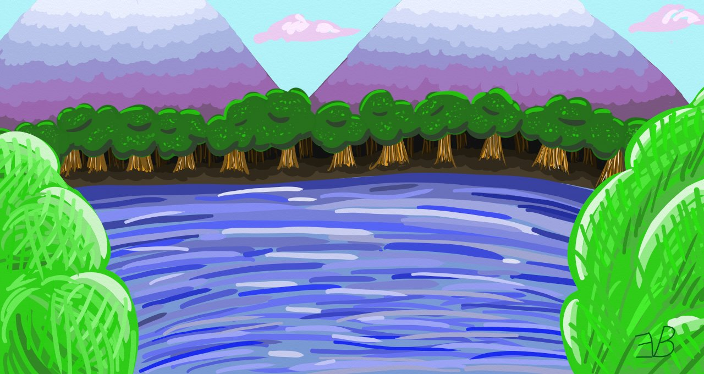

[Back](AuburnS1.md)

# Episode 4

## Memories

The darkness is not peaceful. Darkness is where the eyes watch you, red eyes peeking from their hidden holes like bloody stars in the night sky. The darkness is cold and damp. Water drops plink into hidden pools somewhere in the mirk. The darkness is not still. The sound of shifting creatures and darker shadows zipping through the darkness alert you to the beholders of those watching eyes. But the darkness also keeps you from beholding what monsters lurk within it. You can witness the signs that you aren’t alone here, but the soul-wrenching corruptions that live here are hidden to your blinded eyes. 

---

A bird’s cheerful song fills the air with a joyfulness and light that rouses you from your unrestful sleep. The afternoon sun streaming in on your closed eyelids, making the world a single shade of red and warming your body. With a deep breath, you open your eyes and find yourself in a neat little bed in a small room with little else in it. 

You force yourself to sit up and stretch out your sore muscles. Looking around, you try to figure out if you know this place, but nothing seems familiar. You make your way to the small door and open it carefully so that it doesn’t make a sound. A narrow hall extends out before you and the sounds and smells of people speaking happily around a pile of food emanate from the end of it. Your stomach rumbles at the enticing smells, so you follow your nose down the hall and down the stairs that follow it. 

“Rowen!” Carden stands from the table in the middle of a large room set for your clan and comes to hug you. “I’m so glad you’re okay. You had us so worried.” The rest of your clan makes a similar fuss before inviting you to the table laden with a large selection of amazing smelling food. 

“Oh, well. I’m glad to see you’re up.” Someone you vaguely recognize says upon seeing you as they enter the dining room with another large plate piled with food. “Please, eat something. You must be starving.” Even though you feel like you haven’t met them before in your memory, something about them just seems so familiar.

“Do I know you?” You ask, trying not to sound rude in your tone as you begin filling your plate with food. 

“Emery was kind enough to let us stay here while you were recovering.” Fable says with a mouthful of food. “And the food has been amazing.” 

“I was glad to help. It has been a long time since I have had anyone to care for.” Emery says kindly, setting the food on the table and taking a seat at the only other empty chair at the table. 

“How long have we been here?” You ask. 

“Only a couple days. We decided it was best to wait until you were recovered to start working on the quest beyond collecting some information on what was going on.” Onyx says. 

Everyone is quiet for a moment, enjoying the food thoroughly. As each member of the clan finishes and begins to recline at the table, discussion turns to the quest. “Looks like something is eating all of the fish in the Dragonfly Lagoon, a lake near here. Most of the fishers that live in Dalo go there to fish and the numbers have been drying up.” 

“Do we know that it’s a monster? Maybe they’ve just eaten all the fish there.” You ask. 

“There are few fishers here and the amount they have pulled from that lagoon has never been enough to cause overfishing.” Emery notes. “It is usually just enough for the fishers to eat and maybe a few to sell.” 

The conversation continues for a little longer, but no new information seems to be coming. Finally the conversation shifts once more. “How are you feeling?” Emery asks you. 

“I’m doing fine now, thank you. I’m still not sure what happened and if it will happen again.” You respond. 

“It could just be from the injury.” Carden says. “With all of the other odd things you have been experiencing, it wouldn’t be surprising.”

“You are hurt?” Emery asks with more concern than you expected. 

“Sort of, and it was a few weeks ago now. I’ve been having some strange symptoms, and I guess randomly passing out is among them now.” You explain. 

“What other symptoms?” 

Not wanting to reveal too much, you just say. “Mainly some memory problems.” The conversation continues, but you still feel Emery’s eyes upon you, though you try to ignore it. As the night wears on, the clan begins to retire for the night and you return to the room you woke up in despite not feeling tired. Sitting down on the bed, you set your head in your hands, millions of questions shouting over each other for your attention in your mind. 

There is a quiet knock at the door. You stand and answer it and there stands Sacha. “How are you doing?” 

You shrug, leaving the door open and returning to the bed. “As good as I can be, I guess.” Sacha comes in and sits down beside you on the bed. 

“I think everyone feels that way right now. Fable is starting to feel the pressure of being the leader. Carden never likes traveling through Kadon. Onyx is, well, Onyx.” Sacha sighs. “And of course, you passing out and falling off Aspen, that is just a reminder that you are different, which changes the whole group. Don’t get me wrong, we are all glad you are okay and that you weren’t hurt falling off, but everything feels different.”

“It isn’t my fault.” You murmur. _Lier! It’s all your fault!_ Guilt begins sneaking in. 

“Oh, of course not. There is no guilt that you should carry about what has happened, but nonetheless, things have changed and our team is struggling to keep things together. I’m not sure I will be enough to keep this group together, like I usually do when we hit a rough patch.” Sacha’s head drops. “I fear that if one more thing happens, our clan will fall to pieces and all the people we would have helped will suffer because of it.”

“Do you think we will fall apart that easily?” You ask. “I mean, we have been a clan for a long time.”

“And that whole time, you have been at the helm, leading the team well. Without that leadership, the soul of our clan changes. I think if you don’t start recovering your memory soon, we stand little chance of remaining a clan.” Sacha looks to you. “Has anything felt familiar to you since you can remember?”

“Just some strange things, that I can’t explain.” You pull out the monster sword you had found from amongst the small pile of things that had been set beside your bed. “I found this at Amari’s shop. Carden says it is a monster blade.”

Sacha takes the blade in hand, looking it over thoughtfully. “It is familiar to you?” You nod. Sacha’s brow furrows. “Is there anything else?” 

“For some reason Emery seemed familiar when we first met, but in a way that made me think we hadn’t actually met.” 

“I don’t think we have ever encountered Emery before on our travels. We have only been to Doln a few times. But none of us are familiar? You don’t remember any of us from before?”

“No. Nothing has come back to me.” You shake your head sadly. “Nothing about any of this has made any sense.” A thought crosses your mind. “Is this real?” You ask. 

Sacha looks at you strangely. “What do you mean? Of course this is real. What kind of question is that?”

“It’s just, Carden and I have come across a conversation that I thought we had, but Carden can’t remember. There have been several occasions where I think similar things have happened.” You explain. 

“That’s strange. What other conversations?”

You look to Sacha nervously. “You can’t say anything.” Sacha nods. “There was a conversation that I had with Onyx that I’m not sure really happened, but the topic was delicate, so I don’t really want to bring it up again . . .”

“I see.”

“So, it is hard to know what is real and what is just in my head at this point.” You explain. Sacha nods thoughtfully. “And that’s just one of the things that hasn’t made sense.” You take a deep breath. “I’ve been hearing a voice, in my head, and I don’t know where it is coming from. But when I passed out, the voice seemed to actually be able to cause me not to move.”

“So, you have been hearing a voice and you think now it can actually control you?” Sacha asks. “That sounds like a curse of some kind. Maybe the thunderbird cursed you somehow.” 

“That might make sense. Is there a way to know for sure?”

“I’m afraid no one here will. Only a true wizard would be able to tell. Perhaps next time we got to the One Stop Shop we could ask Kyrie.” Sacha stands. “It would be worth knowing and perhaps finding a way to break the curse.” 

Sacha stands. “I wish there was more I could do for you. I know you have a lot of issues and even more questions.” Sacha leans over and kisses you on the forehead. “Get some sleep. Tomorrow we will start our quest.” Sacha bids you good night and leaves the room. You lay down, but your brain doesn’t rest. Another night you spend with a head full of thoughts unable to rest your mind, so resting your body will have to do.

When the morning comes, the smell of breakfast wafts its way into your room and lours you out. Downstairs, once again the clan is set up at the dining room and preparing for the quest. “Is there anyone who has any knowledge about why this has started?” Carden asks Emery. 

“I don’t know. It has been about a year since the fish began to become scarce.”

“Did anything of note happen a year ago?” You ask. 

“Nothing comes to mind, but I’m not the most social person. I might not have known about something that would have happened.” Emery explains. 

Everyone eats the breakfast that Emery has prepared for you and sets out for Dragonfly Lagoon with packs of travel gear slung on your back. “So, what are we looking for?” You ask as the clan approaches the lagoon. 

“About what we were in Nasall.” Fable says. “Tracks of some sort. Anything that might tell us what has done this to the fish.”

“What if it isn’t a monster that has done this? What if the fish have just gotten sick and died? Or if it is just normal wildlife that has eaten the fish?” You ask. 

“Then we will do what we can and if that is nothing, then we will bring back answers to their questions.” 

The lagoon which lies about a mile from the village sitting near the base of a tall mountain is larger than any of the rivers you have seen so far, but you could easily walk around it without much time passing. Few fishing boats are out on the water. The clan takes the time to walk all the way around the lagoon looking for any clues as to what could be causing the fishing drought, but with little luck. The only tracks you find are those of the fisherman and of the local wildlife that lives near the water. Looking up to the mountain, you notice that there is a river trickling down its side which appears to be filling the lagoon.

“This lagoon is filled from the mountain, isn’t it?” You ask. 

The clan stops a moment and turns to the mountain. “I guess so. When the snow melts, it runs down the mountain and refills the lagoon.” Carden agrees. 

Thinking a moment, you go down to the bank of the lagoon and kneel down. Reaching your hands in, you can feel the water is freezing cold because it was recently ice. Cupping your hands, you bring the water to your face and wash it, refreshing and clearing your head from your lack of sleep. You lick your lips and notice something strange. “Is this water supposed to taste salty?”

“What?” Fable kneels down and takes a sip before spitting it out. “Rowen’s right. The lagoon has gone salty.” 

“That would kill off the fish.” Sacha says. “But why is the lagoon salty?”

With that discovery, your clan walks over to the small pier to see if any of the fishers can give you any more information. “How long has the water been salty?” Fable asks one of them.

“It’s been a while now. Since last summer I believe. No one knows why.” The fisher says. “It’s killen’ off the fish.” 

“Thank you.” Fable says to the fisher, excusing the group to go talk amongst themselves. “So, if the water has been salty since last summer . . .”

“That means that whatever is making the water salty must have been from something in the snow. When the snow melts and fills the lagoon again, the salt would come with it.” Carden finishes. 

“I was going to say that.” Fable yells angrily. 

“You aren’t the only one with a brain, Fable.” Carden snaps back. 

“You aren’t the leader.” 

“And neither are you.” The whole group falls silent, once again feeling the absence of you as a leader. 

“So we should go check out the mountain.” You conclude amongst the silence. “And perhaps after this quest we need to sit down and talk some things out since so much has changed the last few weeks.” 

Carden, still staring daggers at Fable, turns and starts walking off towards the mountain. Onyx and Fable follow behind with you and Sacha bringing up the rear. “Good try.” Sacha whispers to you with a reassuring smile. “And we do have a lot to figure out, but this group isn’t the sit and talk about their feelings sort. I think we may just have to figure it out as we go.” 

The group follows Carden up to the path that leads to the mountain, watching as it winds its way to the top. “Wouldn’t go up there if I were you.” A voice says in the shadows of the trees off to the side of the path. 

“Who are you?” You ask the voice, trying once again to take control of the group as leader. 

A figure appears out of the darkness. A woodsman. “Someone who knows this mountain.”

“What dangers lie here?” You ask. 

“Many from nature itself and many from other mysteries.” The stranger says cryptically. “Either way, staying away from the mountain would be best.”

“Thank you for the warning, but our quest lies up in the mountains. Could you give us some more details about what lies before us?” You press. 

“Watch the skies and stick to the river.” Without another word, the stranger once again disappeared into the forest. 

“Well that was helpful.” Carden says, grumpily. 

“It’s more than we had before.” You say, trying to keep the group positive. “Let’s keep moving.”

The mountain has a winding path that often diverges from the river, but you decide to continue through the bramble to follow the river. “This is taking forever.” Fable grumbles as you crash through what feels like the hundredth bramble patch. “We will need to make camp soon.” 

“We can stop next time we come to a clearing. I don’t want to go far from the river.” You say in your most authoritative tone, continuing to trudge forward. You can hear Fable mumble in quiet tones, but let it pass, turning your focus towards making a path through the bramble and loose rocks. 

It is well after dark before you find a suitable place to rest about halfway up the mountain. “Finally.” Fable grumbles and flops down on the ground. 

“Fable.” Sacha snaps in a chastising tone, but says nothing more, beginning to set up camp. Onyx and Carden follow suit, beginning to start the fire. You step off to the riverbank and take a deep breath, trying to calm your raising frustration with Fable. The cool mountain air helps clear the haze out of your mind, but still it remains. The voice inside your head continues to scream at you despite your attempts to remind yourself it is just a result from the injury. 

You take a seat on the bank of the river, looking out over it in the chilling moonlight. You try your best to let your mind rest, but still no relief comes to you. Between the consistency of the yelling voice and your own thoughts that plague your mind, you can find no peace. The river is quiet and reflects the moonlight with its waters. You eventually reach in and take another sip. It is even saltier than the lagoon down below. Whatever is causing this is certainly up here somewhere. Quietly, you wonder if you will be able to speak with whatever monster is causing this and in what way they will respond to you. 

“You must be hungry.” Sacha brings over a bowl of warmed soup to you. 

“Thank you, Sacha.” Sacha turns to leave, but you begin speaking again. “Did we have a conversation last night?” You ask. 

Sacha sits and thinks. “Not that I remember.” 

“That’s what I thought. Thank you.” Sacha seems confused, but lets you continue sitting on your own. 

The night wears on and the others lay down to sleep, but you don’t even try. The only sleep you have been able to get was when the voice made you pass out, if you can call that sleep. You decide with a monster around, it is probably best for one of you to stay up anyways. 

That’s when all goes silent. You look up and around, startled by the sudden quiet, the voice in your head finally hushing. Finally, you can hear the gentle rushing of the river before you and the crackle of the fire slowly dying. You stand and walk around a moment, making sure that something wasn’t horribly wrong. When you return to where you had been sitting, you find a stag has been watching you from across the river. 

“You are far from home.” You hear it say in a sad and gentle voice. 

“Did you speak?” You say, amazed. Perhaps your gift now extends to animals too. 

“All of us can speak. Few listen.” 

“Why did you decide to speak to me?” You ask. The stag remains silent. “Is there something I can do for you?” 

“There is nothing anyone can do for me.” It lowers its head and releases a single tear into the river. With its head lowered, now you can see that this stag is no stag at all, but the monster you have come up here searching for. On its back is a pair of beautifully colored wings and its hind quarters are feathered with plumage with bird-like feet below. “I have lost someone precious.” It mourns. 

“Tell me what happened.” You press, sitting down across from it. “Tell me of your sadness.” 

The stag-bird lifts its head and looks at you with eyes that hold so many things: wisdom, sadness, knowledge, and grief. “Humans came onto my mountain. They had come before to seek answers to their own griefs, so I let them come into my domain. My mate had perished, so I understood their grief, though I knew they wouldn’t understand mine. When I saw them coming, I would hide myself away with the one thing that remained of my love: our egg. 

“A storm came and trapped the humans on my mountain without what they needed to weather it. I took pity on them and went out from my hiding place to try and help them, but while I was gone in search of them, they found my abode . . . and my child.” By then, a torrent of tears is flowing from the stag-bird’s eyes and filling the river with salty tears. “In their hunger, they took my child while it could not defend itself and ate it.”

“I am so sorry.” you whisper into the night. “That’s horrible.” 

“It was. When I returned, the humans had gone, leaving just the shell of my poor child that I had cared for alone for so long. Now I am alone on my mountain.” The pain filling the poor monster is obvious to you. “I don’t blame the humans for what happened. They can’t understand, but it still hurts.”

“Why don’t you travel to be with your own kind once again?” You ask. 

“My mate and I were the last. We have slowly been killed off by the humans, thinking we were normal beasts of their land. That is why we took refuge up here. Our child was the last hope for us, the peryton.”

“So there are no more of you in monster territory?” 

“None of us left when the humans invaded this land, and that has led to our deaths.” The peryton lays down on the bank across from you. “All that remains for me is to mourn what I have lost and pass beyond this world to be with them once more.” 

“That is such a bleak existence.” You note. “Do you really wish to perish?” 

“I do. I was once a part of thousands, and now I am the last.”

“Is there anything I can do?” You ask. “Anything to help you through this suffering so that your kind does not fade away from this world? Perhaps as you and your family hid, others have as well, also believing they are the last.”

“I suppose it is possible . . .” 

“If there is even a possibility, how can you give up? Your kind must have been mighty at one point. Perhaps now you can recover within the monster territory.” You encourage. 

The peryton looks up to you with a new vigor in its eyes. “You are right, Mirza. I cannot give up on my people.” The peryton stands and bows its head to you. “Thank you for your wisdom in this hard time.” 

“You’re welcome, but my name isn’t Mirza, it’s Rowen.” You respond, but by then, the peryton had already spread its wings and taken off into the sky. Had it recognized you, or did it think you were someone else? You watch as the large wings disappear into the darkness. As soon as it has disappeared, the screaming voice returns, overwhelming you, making you drop to the ground covering your ears. But it does nothing. Neither your body nor your mind get any hope of rest, your body writhing with how loud the voice has become after the silence of a moment ago. 

When morning comes, you are lying, exhausted, on the bank of the river watching the world around you, trying to drown out the noise. “Rowen? Are you okay? You haven’t moved since we went to sleep last night.” Carden asks, gently touching your shoulder. You roll over and look into Carden’s eyes, letting them see the state you are in. “You look horrible.” 

“The monster is gone.” You say weakly with a smile. 

“What? How do you know?” 

“I spoke with it last night. It came to me.” 

“Rowen, I don’t think that happened. I think you are confused.” You roll away from Carden as tears begin  to form in your eyes, overwhelmed and exhausted. “I’m not saying you don’t think it happened . . .” Carden stops, knowing that isn’t the right way to help. “I’m sorry, Rowen. It’s just, with all that you have been through and all of the stuff you have been telling us  . . .” 

“Taste the water.” You sob. Quietly, Carden goes over and takes a sip. 

“What? That doesn’t make any sense.” Carden takes another sip. “It’s not salty anymore.” 

“I spoke with the peryton.” You whisper. Carden turns back and looks at you. You must be such a pitiful sight. 

“I believe you.” Carden nods. “Have you slept at all?”

“I can’t sleep.” You say. “Passing out was the closest thing to sleep I’ve had for a long time and even that was filled with monsters.” 

“We should try some of the herbs that the doctor gave us the next time you go to try and sleep.” Carden says. “You look very weak.” Carden helps you up and brings you closer to the morning fire, explaining the little you spoke of to the rest of the group. 

“How are you just magically able to shoo off every monster now?” Fable asks, still grumpy. “We haven’t gotten a single monster part since you woke up this way.” 

You don’t have the energy to respond, so you just take another sip of soup. 

“You aren’t fit to be leader any more.” Fable spits at you. “You aren’t the friend I grew up with any more.” 

“Fable!” Sacha yells, trying to stop the barrage, but with all the voice has been doing to you, Fable’s angry outburst does very little. 

“You are changed beyond what this group can handle. We need a new leader, and I think it should be me. I’ve been here just as long as Rowen has.” Fable stands, shaking with anger. “I got us through the last few quests just fine.” 

“No, that was still Rowen, just not as a leader.” Onyx says quietly. 

“What did you just say?” Fable gets up in Onyx’s face. 

Onyx’s face becomes hard as stone. “Rowen still got us through the last few quests. Not you.” Their eyes don’t waver and Carden and Sacha have to separate them before an all out fight breaks out. 

With a deep breath, you build some energy to make the speech you need to. You stand and look to Fable. “While I may be different now, I believe I can now step back into the role that I had before with some help from the group.” You turn and look at the rest of the group. “It is true that I don’t understand a lot of what is going on right now, but I still have the makings of a leader in me as long as you can handle the different way I lead now. I know we have been together for years now, but if you can’t handle me as leader any more, you are welcome to leave the clan and find another. Any contracts we had before I no longer remember, so I will not hold you to them.” You turn back to Fable. “But if you choose to stay, you must work under my leadership. You will do your best not to fight with one another. You will remember your role in the clan. You will help me where I need it. Is that understood?” You get up in Fable’s face a little, but not too close, holding eyes with a resolve you find it hard to feel inside. 

Fable’s eyes eventually drop. Fable nods. You sigh and take your seat back by the fire, newly weakened by the effort you just put out. No one else speaks or even moves for a long while as you sit and continue eating your soup. Carden comes over and lets you lean on their shoulder to rest. 

When the sun is up high enough to see, you force yourself up. “We should return to Dalo and let them know their water has been restored.” The rest of the group packs up what little camp remains and you begin to once again descend the mountain. Now that there is a path, the road down is a lot easier, but still you stumble down, your legs almost randomly losing all their strength. 

Finally you reach the bottom and you find yourself needing to rest for a little while, so the clan stops to have their midday meal, once again with little if any conversation. Your speech seems to have helped with the insubordination, but the dynamic of the group is still suffering. 

When you have bolstered enough strength, you return to town. The group drops you off at Emery’s house to rest while they go and report the news to the elders of Dalo. Before going in, you grab the herbs that the doctor told you to try and enter Emery’s house.

“I’m so glad you are back safe.” Emery says happily. “Let me prepare you some food.” 

“Thank you, Emery, but I need rest right now.” You stop Emery. 

“I would like to talk to you while we are alone . . .” 

“I’m sorry, but I am exhausted. Perhaps later.” Emery stops and retreats a little, letting you go up the stairs without speaking again. You stop and look back at Emery, feeling a little bad. “I’m sorry, Emery. I didn’t mean to be rude.” With a sigh you walk back down the stairs. “Let me rest for an hour or so and then we can talk, okay?” Emery nods silently. “And, would you mind bringing me some hot water?” Emery nods again and disappears into the other room. 

Upstairs, you flop down onto the bed and let yourself sink into the comfort. 

Despite your exhaustion and comfort, you know you won’t sleep unless you get some help. The mix of herbs have been ground into powder meant to be put into hot water to make tea. There is a light knock on the door and you answer it to Emery standing there with a pot of hot water and a cup. “I hope this will do.” 

“Perfect.” You respond in as happy a tone as you can muster. “Just set it on the night table.” Emery sets down the pot and cup.

“Is there anything else I can get you?”

“I’m fine for now. Thank you.” 

Emery turns to go, but stops in the doorway. “Auburn . . .” You look up, but Emery stops. “I’m sorry. What I have to say can wait. Please, get some rest. I will check on you later.” Emery closes the door and leaves you alone. What is Auburn?

You have little energy to contemplate what was said, so you pour some hot water into the cup and sprinkle in the herb powder. It’s pungent smell fills the air and you choke down as much as you can. You lay back down on the bed and shut your eyes. The voice fades from your mind and once again there is silence. Soon, you slip off to sleep.

---

It is dark, but you know you are safe. You are supported by a large pair of arms that cradle you carefully, not letting you fall. The arms carry you fast through the darkness, a single pair of footsteps and heavy breathing are the only sounds filling the dark air. You suddenly stop, but the panting continues. “I’m going to get you out of here, little one.” You hear a warm familiar whisper. “I won’t leave you to the fate of that monster.” 

The quick footfalls continue. It takes all of your strength to open your eyes. Above you is a ceiling of stone that passes quickly by and a face that looks so familiar. You know you are safe with this person, though. Your eyes gently close and you know no more. 

---

“Rowen, wake up.” Carden shakes you awake, the morning sun streaming in through the window. “We need to go. Onyx’s parents are sick. We need to go to them quickly.” You push yourself up, trying to rub as much of the sleep out of your eyes as possible. 

“But I needed to talk with Emery.” You yawn, but stop mid yawn, remembering your dream. You know why the face looked familiar. It was Emery’s face you saw above you. “I most definitely need to speak with Emery.”

“There is no time. The kind of sickness that Onyx’s parents have . . . they don’t have long.” You concede and pull together your things before Carden pulls you from the room and out the front door. The others are already on their horses, waiting for the two of you. You look back at the house and see Emery standing at the door sadly. You very much wish you had time to speak, but the time is not now. 

“I will come back as soon as I can. I promise.” You yell back before leading the clan off towards the direction you hope is Doln.

## *End of Episode 4*

Next Episode - To Come

[Back](AuburnS1.md)
